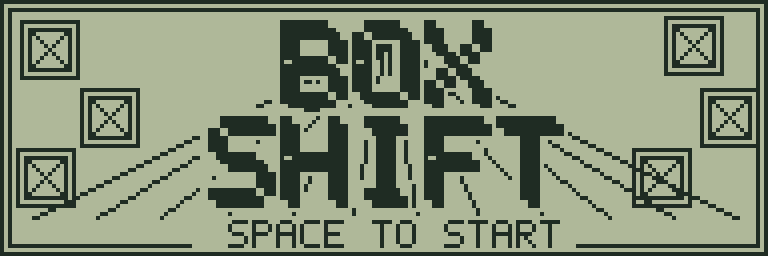
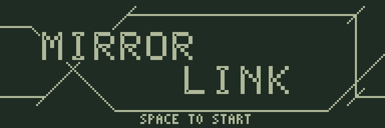
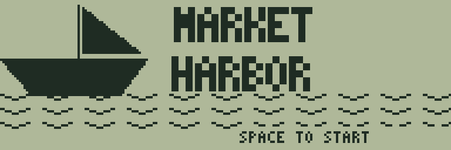
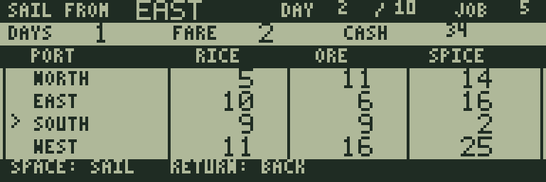

# 50作品の画面設計

全作品のタイトルを、192×64ドットの独立した構図で描き直しました。ロゴの書体・大きさ・位置、白黒の配分、背景の密度を作品ごとに変えています。タイトルと説明画面は分け、タイトルにはSPACEの開始案内を残しています。

箱・壁・カードなどに奥行きを加え、数字も作品ごとに調整しました。50作品それぞれの採用判断と、読みやすい平面表示を保った理由は[奥行きと数字の意匠](depth-design.md)、40面の評価画面とパスワードは[パズルのチャレンジ設計](puzzle-design.md)を参照してください。

| テイスト | 例 | 表現 |
|---|---|---|
| 荷札・工業製品 | BOX SHIFT、POCKET FACTORY、BALANCE DOCK | 木箱、ライン、積荷と数字の計器 |
| 幾何学・光学 | MIRROR LINK、LAMP GRID、PIPE WEAVE | 反射線、図形、輪郭文字、配管 |
| 戦術・端末 | STEP STRIKE、HEX FRONT、SIGNAL GHOST | 斜めの切り替え、暗い地、細い文字と計器 |
| 本・盤上遊戯 | REVERSI MINI、KNIGHT TOUR、MICRO ROGUE | セリフ、余白、駒、手帳風の情報欄 |
| カード卓 | CIRCUIT DECK、ACE STACK、SUIT RUN | カードそのものを主役にした構図 |
| 地形・風景 | ARC DUEL、WIND PUTT、ECHO CAVERN | 山、地面、洞窟のシルエット |
| 航路・作業帳 | MARKET HARBOR、RAIL DISPATCH、ORCHARD DAYS | 船、時刻表、畑と帳簿・状態欄 |
| スポーツ・音 | RALLY RETURN、PENALTY ARC、BEAT STEP | 斜体、ゴール、レベルメーターと対戦スコア |

## HUD

盤面型の作品では、128×56ドットのプレイ領域を右寄せ・中央・左寄せに配置しています。左右の対戦スコア、荷札の手数、探索時の装備とHPゲージなど、遊びに必要な情報に合わせて文字の大きさと配置を選びました。

CIRCUIT DECKは横に3枚のカードを並べた卓、MARKET HARBORは取引と出航先の2種類の帳簿です。ARC DUELは地形の幅を192ドットのまま保ち、上の2段に角度・威力・風・体力・勝数をまとめています。クリアと失敗は中央の表示で知らせ、SPACEで続行できます。

## 描画と入力

画像はすべてプロジェクトのPythonコードから生成する独自の1bitデータです。タイトルの拡大・装飾処理は生成時に済ませます。HUDの背景は画面を開いたときだけ描き、数値と選択表示は値が変わったときだけ更新します。大きな数字やゲージも、以前の表示を含む同じ領域を塗り直します。

フレームバッファーは1枚です。8ドット高の帯ごとに変更した横範囲を記録し、LCDコントローラーの境界とBUSYを確認して転送します。文字間と背景の短い描画区間でもキーを走査します。画面の配置を変えても、ゲームの論理座標と共通操作は同じです。

## RAM配置

| アドレス | 用途 |
|---|---|
| `$2000–$27FF` | BASICの作業領域を保持 |
| `$2800–$53FF` | コード、画像、ゲーム状態、追加の面データをまとめて配置 |
| `$5400–$57FF` | HUDフォント、BASIC復帰処理と保存する内部RAMの内容 |
| `$5800–$5DFF` | 1,536バイトの描画面 |
| `$5E00–$5FFF` | 512バイトのスタック予約 |

各領域の超過はリンク時にエラーになります。BASICへ戻ると、以前のBASICプログラムと変数は消去されます。実機での表示・入力・復帰は未検証です。実行結果と測定値は[検証記録](validation.md)を参照してください。

## 編集する場所

- `games/tools/visual_art.py`: 50作品のタイトルの構図とロゴ
- `games/tools/depth_art.py`: マスの寸法内に収まる陰影・斜めの辺
- `games/tools/digit_art.py`: 計器風・活字風・丸みのある数字の原画
- `games/tools/hud_layouts.py`: 盤面型のHUDと表示値
- `games/tools/hud_custom.py`: カード卓・交易帳簿・砲台計器
- `games/tools/hud_assets.py`: HUDの画像、書体、値の定義を機械語ソースへ生成
- `games/common/visual-hud.s`: キャッシュ付きの文字・数値・ゲージ描画

各作品の`make`で再生成します。`node games/tools/preview.mjs`は実際にエミュレーターを起動し、原寸と4倍のタイトル・初期画面を`build/visual-redesign/`へ保存します。
