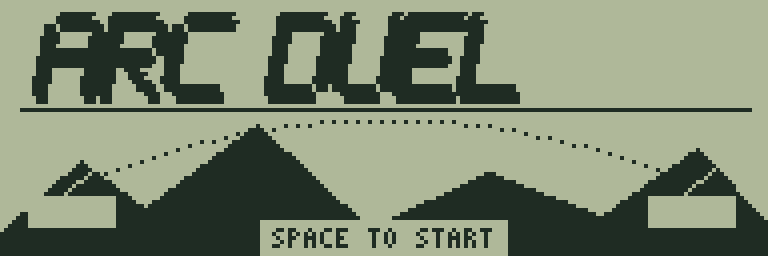
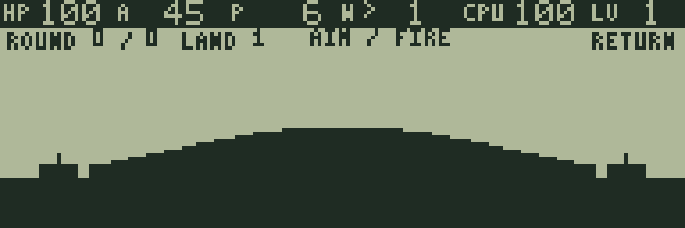
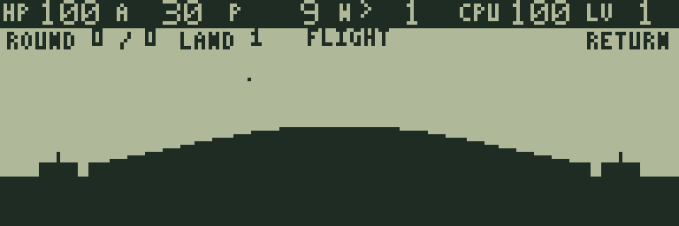
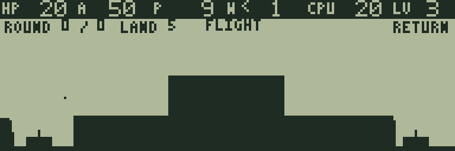

# ARC DUEL

[ゲーム一覧](https://github.com/zabaglione/jr800-web-emulator/wiki) / [シューティング](https://github.com/zabaglione/jr800-web-emulator/wiki/Genre-Shooting) · 定番

[遊ぶ](https://zabaglione.github.io/jr800-web-emulator/?program=arc-duel) · [ビルド可能なソース](https://github.com/zabaglione/jr800-web-emulator/tree/main/games/arc-duel)



風を読み、地形を削りながらCPUの砲台と戦う弾道対戦です。6種類の地形と3段階の難易度があります。

## 遊び方

Aは角度（15〜75度）、Pは威力（2〜9）、Wは風です。>の風は右向き、<の風は左向き、-は無風です。CPUは相手のHP、ROUNDは自分とCPUの勝数、LANDは地形番号です。爆風は近い砲台に最大40のダメージを与え、自分にも当たります。HPを0にするとラウンド勝利。2勝先取で対戦クリアです。次のラウンドでは地形が変わります。CPU AIM中もメニューを開けます。

上下で角度、左右で威力を調整し、SPACEで発射します。ラウンド終了後もSPACEで続行。RETURNの **NEXT TERRAIN** は次の地形で対戦を最初からやり直し、**TOGGLE HELP** は案内を切り替えます。

## ゲーム画面



風・角度・威力を決める。



放物線を描く砲弾。



爆発で変形した地形での対戦。

## 共通操作

| 操作 | キー |
|---|---|
| 上・下・左・右 | テンキー8・2・4・6、またはW・S・A・D |
| 決定・開始・主要アクション | SPACE |
| 取消・戻る・操作メニュー | RETURN |
| BASICへ終了 | BREAK |

メニューを開いている間はゲームが停止します。決定・取消は押した瞬間だけ反応し、移動だけ長押しできます。

## 確認済み環境

JR-HuBASIC 1.0を使ったWebエミュレーターで確認しています。ゲームは標準16KB RAM内に収まり、拡張RAMなしのNative/WASM再生でも検証しています。ブラウザーのBASIC起動には既存のBASIC実験プロファイルを使用します。2.0は対応未確認です。実機動作・カセット転送・実機のLCD応答と音は未検証です。

BREAKで戻る際には、以前のBASICプログラムと変数が消去されます。必要な内容はゲームを読み込む前に保存してください。途中経過はエミュレーターの汎用状態保存で保存できます。ROMとROM入り状態ファイルは配布しません。

## ビルド

```sh
make -C games/arc-duel
make -C games/arc-duel test
```

環境の準備・一括ビルドは[Games README](https://github.com/zabaglione/jr800-web-emulator/tree/main/games)を参照してください。画像とマップを含む新規制作物はMIT Licenseです。
