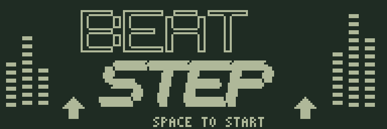
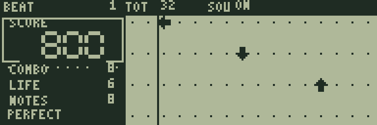
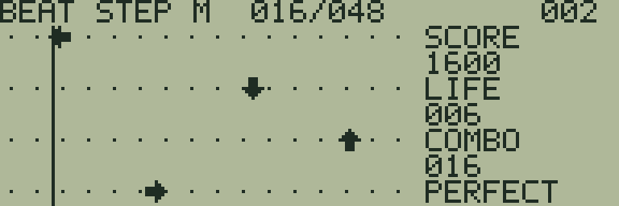
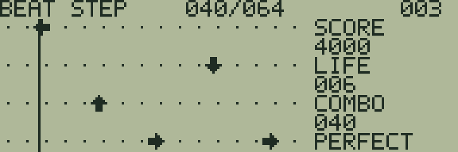

# BEAT STEP

[ゲーム一覧](https://github.com/zabaglione/jr800-web-emulator/wiki) / [スポーツ・タイミング](https://github.com/zabaglione/jr800-web-emulator/wiki/Genre-Sports) · モダン

[遊ぶ](https://zabaglione.github.io/jr800-web-emulator/?program=beat-step) · [ビルド可能なソース](https://github.com/zabaglione/jr800-web-emulator/tree/main/games/beat-step)



流れてくる矢印に合わせて4方向を押すリズムゲームです。3つの譜面を、6回のミスになる前に最後まで進めます。

## 遊び方

SPACEで譜面を開始すると、矢印が右から左へ流れます。レーンは上から左・下・上・右です。矢印の中央が左寄りの縦の判定線へ来るタイミングで、対応する方向を押してください。テンキー4・2・8・6、またはA・S・W・Dを使います。押した瞬間だけを判定し、長押しのリピートでは次の音符を取れません。同じ方向が続く場合も、一度離して押し直します。

タイミングが近いとPERFECTで100点、判定幅の中ならGOODで60点です。連続して成功するとCOMBOが増え、MISSで0に戻ります。方向違い・早すぎる入力・遅すぎる入力・見逃しはLIFEを1減らします。見逃しを処理した同じ更新では、遅れて押したキーを追加のミスとして数えません。

LIFEが0になると失敗します。残っている間に最後の音符まで進むとクリアです。NOTESは処理した音符数、上部のTOTは全音符数、SCOREは得点、COMBOは現在の連続成功数です。

難易度1は32音符、2は48音符、3は64音符です。音符の間隔は順に約0.65秒・0.49秒・0.39秒相当のCPU時間で、判定幅も難しくなるほど狭くなります。タイミングと短いビート音はエミュレーターのCPUサイクルに合わせます。長い曲の再生ではありません。

RETURNのメニューでは譜面が止まり、復帰後に続きから再開します。SOUNDでビート音の有無を切り替え、上部のSOUがONまたはOFFになります。RESETまたはRETRYで選んだ譜面を最初からやり直します。失敗画面のSPACEで再挑戦、クリア後のSPACEで次の譜面へ進みます。

## ゲーム画面



矢印の中央が縦線へ来るタイミングで対応する方向を押す。



押して離すリズムを保ち、コンボをつなぐ。



速い譜面では次に来る方向も先に読む。

## 共通操作

| 操作 | キー |
|---|---|
| 上・下・左・右 | テンキー8・2・4・6、またはW・S・A・D |
| 決定・開始・主要アクション | SPACE |
| 取消・戻る・操作メニュー | RETURN |
| BASICへ終了 | BREAK |

メニューを開いている間はゲームが停止します。決定・取消は押した瞬間だけ反応し、移動だけ長押しできます。

クリア後は解き終えた盤面をしばらく残し、ジングルと余韻の後に結果を表示します。続行案内が出てからSPACEを押してください。押しっぱなしでは次へ進みません。

## 確認済み環境

JR-HuBASIC 1.0を使ったWebエミュレーターで確認しています。ゲームは標準16KB RAM内に収まり、拡張RAMなしのNative/WASM再生でも検証しています。ブラウザーのBASIC起動には既存のBASIC実験プロファイルを使用します。2.0は対応未確認です。実機動作・カセット転送・実機のLCD応答と音は未検証です。

BREAKで戻る際には、以前のBASICプログラムと変数が消去されます。必要な内容はゲームを読み込む前に保存してください。途中経過はエミュレーターの汎用状態保存で保存できます。ROMとROM入り状態ファイルは配布しません。

## ビルド

```sh
make -C games/beat-step
make -C games/beat-step test
```

環境の準備・一括ビルドは[Games README](https://github.com/zabaglione/jr800-web-emulator/tree/main/games)を参照してください。画像とマップを含む新規制作物はMIT Licenseです。
