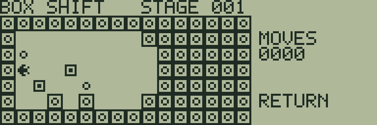
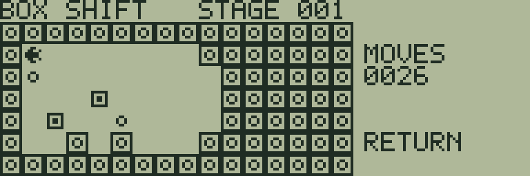
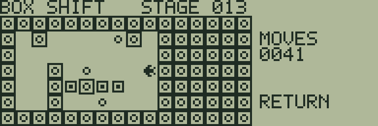

# BOX SHIFT

[ビルド可能なソース](https://github.com/zabaglione/jr800-web-emulator/tree/main/games/box-shift)


箱を押してすべての丸い目標に置く、全20面の倉庫パズルです。

## 遊び方

箱は1個ずつ押せます。引くことはできません。壁際で動かせなくなったら1手戻すか、面をやり直してください。手数は最大9999まで表示します。

方向キーで移動。RETURNのメニューから **UNDO ONE MOVE**（1手戻す）、**HELP**（ヒント表示）、**RETRY**（面の再挑戦）を選べます。SPACEはメニューの決定に使います。

## ゲーム画面



最初の倉庫と箱・目標。



箱を押す順序を考える場面。



後半の倉庫配置。

## 共通操作

| 操作 | キー |
|---|---|
| 上・下・左・右 | テンキー8・2・4・6、またはW・S・A・D |
| 決定・開始・主要アクション | SPACE |
| 取消・戻る・操作メニュー | RETURN |
| BASICへ終了 | BREAK |

メニューを開いている間はゲームが停止します。決定・取消は押した瞬間だけ反応し、移動だけ長押しできます。

## 確認済み環境

JR-HuBASIC 1.0を使ったWebエミュレーターで確認しています。ゲームは標準16KB RAM内に収まり、拡張RAMなしのNative/WASM再生でも検証しています。ブラウザーのBASIC起動には既存のBASIC実験プロファイルを使用します。2.0は対応未確認です。実機動作・カセット転送・実機のLCD応答と音は未検証です。

BREAKで戻る際には、以前のBASICプログラムと変数が消去されます。必要な内容はゲームを読み込む前に保存してください。途中経過はエミュレーターの汎用状態保存で保存できます。ROMとROM入り状態ファイルは配布しません。

## ビルド

```sh
make -C games/box-shift
make -C games/box-shift test
```

環境の準備・一括ビルドは[Games README](https://github.com/zabaglione/jr800-web-emulator/tree/main/games)を参照してください。画像とマップを含む新規制作物はMIT Licenseです。
