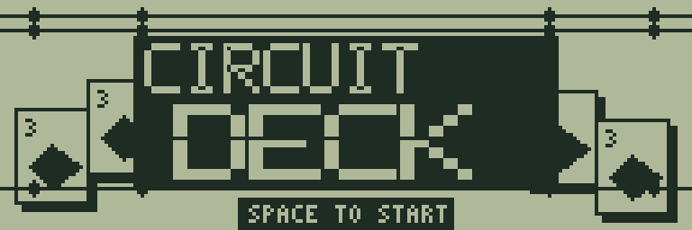
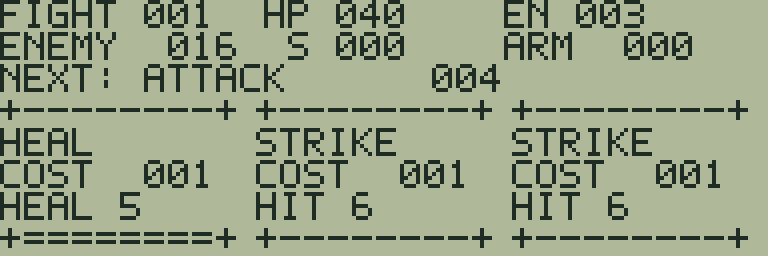
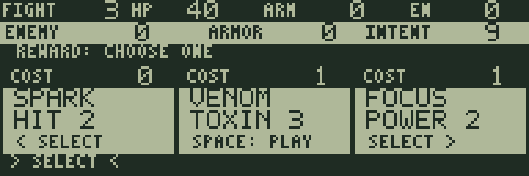
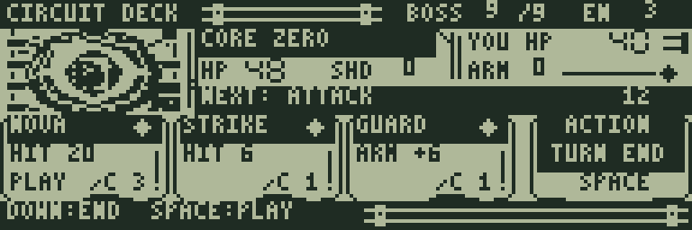

# CIRCUIT DECK

[ゲーム一覧](https://github.com/zabaglione/jr800-web-emulator/wiki) / [カード・ダイス](https://github.com/zabaglione/jr800-web-emulator/wiki/Genre-Cards) · モダン

[遊ぶ](https://zabaglione.github.io/jr800-web-emulator/?program=circuit-deck) · [ビルド可能なソース](https://github.com/zabaglione/jr800-web-emulator/tree/main/games/circuit-deck)



カードで攻撃と防御を選び、9体のボスを順番に倒すゲームです。自分のHPを守りながら、勝利報酬でデッキを強くしていきます。

## 遊び方

自分のHPは40から始まります。目の前のボスのHPを0にすれば勝利、自分のHPが0になると敗北です。9体すべてを倒すとクリアになります。

まず **NEXT** を見て、ターンを終えたときの敵の行動を確認しましょう。**ATTACK 4** なら4ダメージの攻撃、**SHIELD 6** なら敵が防御を6増やします。敵の顔の横の **HP / SHD** は敵の体力と防御、右上の **YOU HP / ARM** は自分の体力と防御です。

左右でカードを選び、SPACEで使います。カード下の **C** は使用に必要なエナジーで、右上の **EN** 以下なら使えます。例えば **STRIKE** はENを1使って6ダメージ、**GUARD** はENを1使って自分の防御を6増やします。防御があるとダメージを先に受け止めるので、敵が4ダメージを予告しているならGUARDでHPの減少を防げます。

カードを使い終えたら、**下キーで画面右下の TURN END を選び、SPACEでターンを終えます**。上キーで手札へ戻れます。残したカードは捨て札になり、敵が予告した行動を実行した後、3枚の新しい手札とEN 3で次のターンが始まります。使ったカードも捨て札へ移り、山札がなくなると捨て札を混ぜて再利用します。

攻撃・回復・防御の変化は、該当する数字の点滅と1ずつの増減で表示します。防御に止められた攻撃は **BLOCKED BY SHIELD** と表示されます。カードごとに異なるSEが鳴ります。

ボスを倒すと勝利のジングルが鳴り、3枚の報酬カードから1枚を方向キーとSPACEで選びます。選んだカードをデッキに加え、HPを12回復して（上限40）、次のボスへ進みます。登場時にはボスを大きく表示し、名前とセリフを紹介します。ボスは左右で異なる武装や配線を持ち、左上からの光を意識した陰影と、背景から区別する白縁・黒い輪郭で描かれています。戦闘画面や登場・勝利・クリア画面は、タイトルに合わせた回路の配線とカードの意匠で統一しています。最後のボスを倒すと、専用のクリア演出と別のジングルが流れます。難易度は1〜3から選べます。

| カード | COST | 効果 |
|---|---:|---|
| STRIKE | 1 | 6ダメージ |
| GUARD | 1 | 防御6 |
| SPARK | 0 | 2ダメージ |
| PIERCE | 2 | 12ダメージ |
| WALL | 2 | 防御12 |
| HEAL | 1 | HPを5回復 |
| VENOM | 1 | 毒3を付与。敵ターンごとに継続ダメージ |
| CHARGE | 0 | エナジーを1増やす |
| DRAIN | 2 | 7ダメージ、HPを4回復 |
| NOVA | 3 | 20ダメージ |
| FOCUS | 1 | この戦闘中の攻撃力を2増やす |
| ECHO | 1 | 4ダメージ、防御4 |

防御は次の敵行動まで有効です。VENOMの毒は敵ターンの最初にダメージを与え、FOCUSの攻撃力上昇はその戦闘中続きます。毒と攻撃力上昇は各99が上限で、次のボスではリセットされます。

| 順番 | ボス |
|---:|---|
| 1 | SPARK IMP |
| 2 | WIRE WOLF |
| 3 | IRON MOTH |
| 4 | COIL CRAB |
| 5 | TWIN FANG |
| 6 | NOVA EYE |
| 7 | GEAR KING |
| 8 | VOID WARD |
| 9 | CORE ZERO |

操作対象のマスや項目はゆっくり点滅します。方向キーを押すと選択位置がすぐにはっきり表示されます。

## ゲーム画面



手札・エナジー・敵の予告。



勝利後の3択報酬。



最終戦のボス。

## プレイ動画

[プレイ動画を見る（30秒・音声あり）](https://zabaglione.github.io/jr800-web-emulator/videos/#circuit-deck)

通常速度で操作と演出を確認できます。再生・一時停止・シークは動画ページで操作できます。

## 共通操作

| 操作 | キー |
|---|---|
| 上・下・左・右 | テンキー8・2・4・6、またはW・S・A・D |
| 決定・開始・主要アクション | SPACE |
| 取消・戻る・操作メニュー | RETURN |
| BASICへ終了 | BREAK |

メニューを開いている間はゲームが停止します。決定・取消は押した瞬間だけ反応し、移動だけ長押しできます。

クリア後は解き終えた盤面をしばらく残し、ジングルと余韻の後に結果を表示します。続行案内が出てからSPACEを押してください。押しっぱなしでは次へ進みません。

## 確認済み環境

JR-HuBASIC 1.0を使ったWebエミュレーターで確認しています。ゲームは標準16KB RAM内に収まり、拡張RAMなしのNative/WASM再生でも検証しています。ブラウザーのBASIC起動には既存のBASIC実験プロファイルを使用します。2.0は対応未確認です。実機動作・カセット転送・実機のLCD応答と音は未検証です。

BREAKで戻る際には、以前のBASICプログラムと変数が消去されます。必要な内容はゲームを読み込む前に保存してください。途中経過はエミュレーターの汎用状態保存で保存できます。ROMとROM入り状態ファイルは配布しません。

## ビルド

```sh
make -C games/circuit-deck
make -C games/circuit-deck test
```

環境の準備・一括ビルドは[Games README](https://github.com/zabaglione/jr800-web-emulator/tree/main/games)を参照してください。画像とマップを含む新規制作物はMIT Licenseです。
