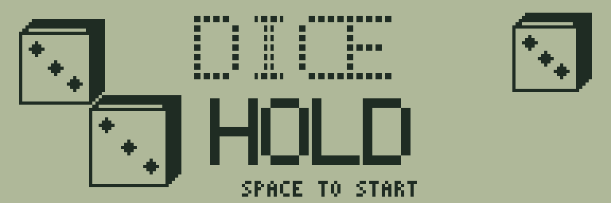
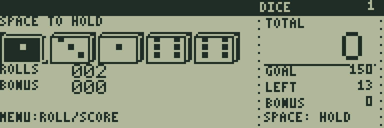
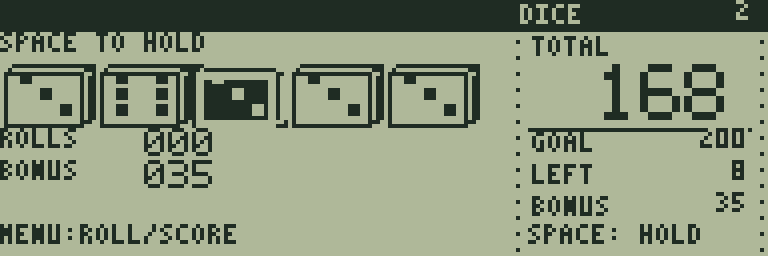
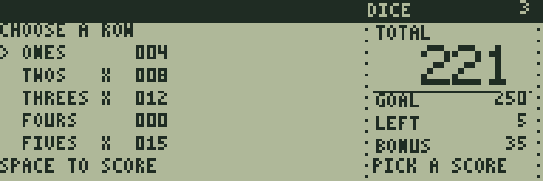

# DICE HOLD

[ゲーム一覧](https://github.com/zabaglione/jr800-web-emulator/wiki) / [カード・ダイス](https://github.com/zabaglione/jr800-web-emulator/wiki/Genre-Cards) · 定番

[ビルド可能なソース](https://github.com/zabaglione/jr800-web-emulator/tree/main/games/dice-hold)



5個のダイスを保持・振り直しし、13種類の得点欄を埋めるダイスゲームです。3段階の得点目標に挑戦します。

## 遊び方

各手番の最初に5個のダイスを振ります。左右キーでダイスを選び、SPACEで保持を切り替えます。保持したダイスは二重の枠になります。RETURNメニューのROLLで保持していないダイスを振り直します。ROLLSは残りの振り直し回数で、最初の出目を含めて各手番3回までです。

RETURNメニューのSCOREで得点欄を選びます。方向キーで欄を移動し、表示された点数をSPACEで確定します。Xの欄は使用済みです。各欄は1回だけ使え、0点で埋めることもできます。得点欄の選択中はRETURNでダイスの画面へ戻れます。

ONES〜SIXESは対応する数字の合計です。3-KINDと4-KINDは同じ目が3個以上・4個以上なら全ダイスの合計点、HOUSEは3個と2個の組で25点、SMALLは4連続の数字で30点、LARGEは5連続で40点、5-KINDは同じ目5個で50点、CHANCEは条件なしで全ダイスの合計点です。ONES〜SIXESの合計が63点以上になるとBONUSが35点加算されます。

13欄をすべて埋めたとき、TOTALがGOAL以上ならクリアです。難易度1・2・3の目標は150・200・250点です。LEFTは残りの得点欄です。得点を確定した後の取り消しはありません。RETRYで新しいゲームを始めます。

## ゲーム画面



5個の出目から保持するダイスを選ぶ。



保持したダイスを残して振り直した場面。



得点欄ごとの点数と使用済みの印を確認。

## 共通操作

| 操作 | キー |
|---|---|
| 上・下・左・右 | テンキー8・2・4・6、またはW・S・A・D |
| 決定・開始・主要アクション | SPACE |
| 取消・戻る・操作メニュー | RETURN |
| BASICへ終了 | BREAK |

メニューを開いている間はゲームが停止します。決定・取消は押した瞬間だけ反応し、移動だけ長押しできます。

## 確認済み環境

JR-HuBASIC 1.0を使ったWebエミュレーターで確認しています。ゲームは標準16KB RAM内に収まり、拡張RAMなしのNative/WASM再生でも検証しています。ブラウザーのBASIC起動には既存のBASIC実験プロファイルを使用します。2.0は対応未確認です。実機動作・カセット転送・実機のLCD応答と音は未検証です。

BREAKで戻る際には、以前のBASICプログラムと変数が消去されます。必要な内容はゲームを読み込む前に保存してください。途中経過はエミュレーターの汎用状態保存で保存できます。ROMとROM入り状態ファイルは配布しません。

## ビルド

```sh
make -C games/dice-hold
make -C games/dice-hold test
```

環境の準備・一括ビルドは[Games README](https://github.com/zabaglione/jr800-web-emulator/tree/main/games)を参照してください。画像とマップを含む新規制作物はMIT Licenseです。
