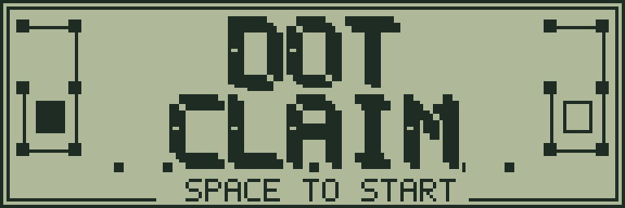
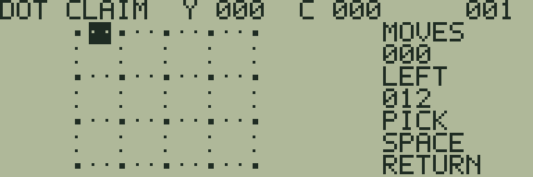
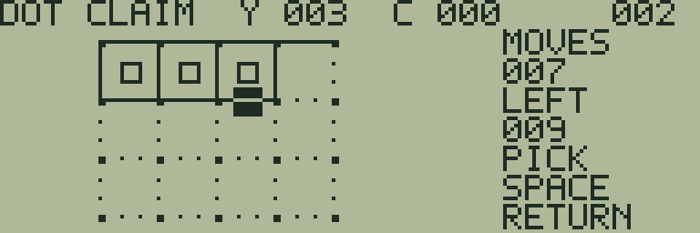
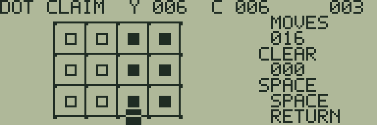

# DOT CLAIM

[ゲーム一覧](https://github.com/zabaglione/jr800-web-emulator/wiki) / [盤上戦略](https://github.com/zabaglione/jr800-web-emulator/wiki/Genre-Board) · 定番

[ビルド可能なソース](https://github.com/zabaglione/jr800-web-emulator/tree/main/games/dot-claim)



点の間に辺を引き、四角を閉じて陣地を取るCPU対戦です。12個の四角を争い、閉じると続けて手を打てます。

## 遊び方

方向キーで点の間の辺を選び、SPACEで線を引きます。最後の1辺を引いて四角を閉じると、その四角を獲得し、続けてもう1手打てます。1本の辺で2つの四角を同時に取れることもあります。CPUにも同じ連続手番の規則が適用されます。

白い四角が自分、黒い四角がCPUの陣地です。上部のYが自分、CがCPUの得点、LEFTが未獲得の四角数です。12個をすべて取った時点で、多い側が勝利です。6対6なら引き分けで、画面はCLEARとなります。

CPUの難易度1は空いている辺を順に選び、2はすぐ閉じられる四角を優先し、3は相手に3辺の四角を渡す手も避けます。RETURNのUNDO TURNで直前に引いた辺と、その後のCPUの連続手番をまとめて戻します。RESETで新しい対局にします。

## ゲーム画面



点と辺を選んで始める対局。



連続して四角を取り自分の陣地を広げる。



12個の四角を分け合った対局結果。

## 共通操作

| 操作 | キー |
|---|---|
| 上・下・左・右 | テンキー8・2・4・6、またはW・S・A・D |
| 決定・開始・主要アクション | SPACE |
| 取消・戻る・操作メニュー | RETURN |
| BASICへ終了 | BREAK |

メニューを開いている間はゲームが停止します。決定・取消は押した瞬間だけ反応し、移動だけ長押しできます。

## 確認済み環境

JR-HuBASIC 1.0を使ったWebエミュレーターで確認しています。ゲームは標準16KB RAM内に収まり、拡張RAMなしのNative/WASM再生でも検証しています。ブラウザーのBASIC起動には既存のBASIC実験プロファイルを使用します。2.0は対応未確認です。実機動作・カセット転送・実機のLCD応答と音は未検証です。

BREAKで戻る際には、以前のBASICプログラムと変数が消去されます。必要な内容はゲームを読み込む前に保存してください。途中経過はエミュレーターの汎用状態保存で保存できます。ROMとROM入り状態ファイルは配布しません。

## ビルド

```sh
make -C games/dot-claim
make -C games/dot-claim test
```

環境の準備・一括ビルドは[Games README](https://github.com/zabaglione/jr800-web-emulator/tree/main/games)を参照してください。画像とマップを含む新規制作物はMIT Licenseです。
