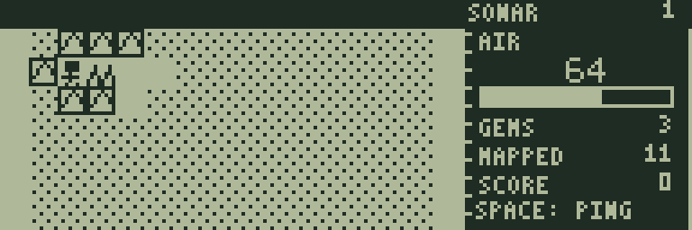
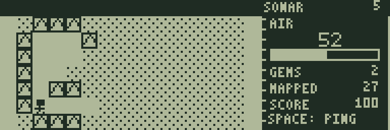
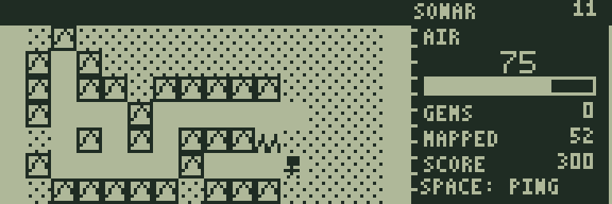

# ECHO CAVERN

[ゲーム一覧](https://github.com/zabaglione/jr800-web-emulator/wiki) / [探索・冒険](https://github.com/zabaglione/jr800-web-emulator/wiki/Genre-Adventure) · モダン

[遊ぶ](https://zabaglione.github.io/jr800-web-emulator/?program=echo-cavern) · [ビルド可能なソース](https://github.com/zabaglione/jr800-web-emulator/tree/main/games/echo-cavern)


音波で見えない洞窟を調べ、酸素を管理して結晶3個を持ち帰る全12面の探索ゲームです。

## 遊び方

テンキー2468またはWASDで移動し、SPACEで音波を発します。音波は通路に沿った距離で3マス先まで届き、壁に当たるとその先へ進みません。発見した地形と資源は記録に残ります。点の模様は未調査の場所です。最初だけ無料の音波で入口付近を調べます。

1歩でAIRを1、音波1回で2消費します。とげへ入ると合計3消費します。壁へぶつかるとその壁を発見しますが酸素は減りません。未調査の通路にも進めますが、危険地形が隠れていることがあります。操作しない間は酸素が減りません。

AIRは1〜4面が64、5〜8面が60、9〜12面が56で始まります。酸素ボンベを拾うと24回復し、上限は99です。消費後のAIRが0になると、ボンベや出口のマスでも失敗します。ボンベは一度拾うと消えるため、往復して回復を繰り返すことはできません。

菱形の結晶を3個集めてGEMSを0にし、矢印の出口へ進むとクリアします。結晶は各100点、クリア時は残りAIR×5点です。SCOREは得点、右上の数字は面番号、MAPPEDは調査済みのマス数を表します。

RETURNでメニューを開きます。SONARはSPACEと同じ音波操作、RESETとRETRYはその面のやり直しです。失敗画面ではSPACEで再挑戦します。全12面は開始時のSTAGE画面で選べます。

## ゲーム画面



入口から音波で調べた範囲と未調査の洞窟。



通路に沿って広がる調査記録。



結晶を集め、酸素を残して出口を探す。

## 共通操作

| 操作 | キー |
|---|---|
| 上・下・左・右 | テンキー8・2・4・6、またはW・S・A・D |
| 決定・開始・主要アクション | SPACE |
| 取消・戻る・操作メニュー | RETURN |
| BASICへ終了 | BREAK |

メニューを開いている間はゲームが停止します。決定・取消は押した瞬間だけ反応し、移動だけ長押しできます。

## 確認済み環境

JR-HuBASIC 1.0を使ったWebエミュレーターで確認しています。ゲームは標準16KB RAM内に収まり、拡張RAMなしのNative/WASM再生でも検証しています。ブラウザーのBASIC起動には既存のBASIC実験プロファイルを使用します。2.0は対応未確認です。実機動作・カセット転送・実機のLCD応答と音は未検証です。

BREAKで戻る際には、以前のBASICプログラムと変数が消去されます。必要な内容はゲームを読み込む前に保存してください。途中経過はエミュレーターの汎用状態保存で保存できます。ROMとROM入り状態ファイルは配布しません。

## ビルド

```sh
make -C games/echo-cavern
make -C games/echo-cavern test
```

環境の準備・一括ビルドは[Games README](https://github.com/zabaglione/jr800-web-emulator/tree/main/games)を参照してください。画像とマップを含む新規制作物はMIT Licenseです。
