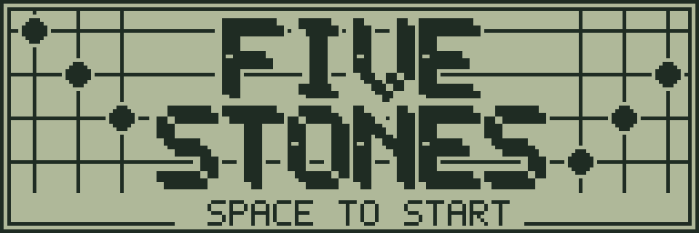
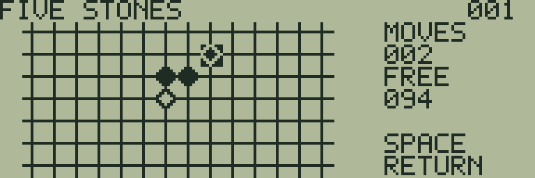
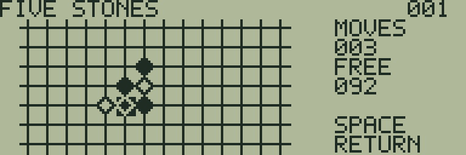
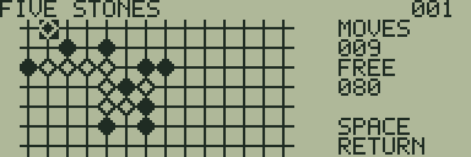

# FIVE STONES

[ゲーム一覧](https://github.com/zabaglione/jr800-web-emulator/wiki) / [盤上戦略](https://github.com/zabaglione/jr800-web-emulator/wiki/Genre-Board) · 定番

[ビルド可能なソース](https://github.com/zabaglione/jr800-web-emulator/tree/main/games/five-stones)



14×7の盤面で5個の石を並べるCPU対戦です。両端が空いた攻め筋と相手のリーチを読む五目並べです。

## 遊び方

自分は白い輪、CPUは黒い石です。方向キーで交点を選び、SPACEで置きます。横・縦・斜めに5個以上並べれば勝ちです。禁じ手はなく、長い連も勝ちになります。満杯なら引き分けです。

CPUは即勝利・リーチへの防御・両端が空いている三連や四連・中央への配置を評価します。MOVESは自分の手数、FREEは空き交点の数です。終了時はYOU WIN・CPU WIN・DRAWを表示します。

RETURNからUNDO TURNで自分とCPUの直前の1ターンを戻せます。RESETまたはRETRYで新しい対局を開始します。

## ゲーム画面



白と黒が中央から攻める序盤。



複数の方向へ石を伸ばす中盤。



最後の攻め筋を作る場面。

## 共通操作

| 操作 | キー |
|---|---|
| 上・下・左・右 | テンキー8・2・4・6、またはW・S・A・D |
| 決定・開始・主要アクション | SPACE |
| 取消・戻る・操作メニュー | RETURN |
| BASICへ終了 | BREAK |

メニューを開いている間はゲームが停止します。決定・取消は押した瞬間だけ反応し、移動だけ長押しできます。

## 確認済み環境

JR-HuBASIC 1.0を使ったWebエミュレーターで確認しています。ゲームは標準16KB RAM内に収まり、拡張RAMなしのNative/WASM再生でも検証しています。ブラウザーのBASIC起動には既存のBASIC実験プロファイルを使用します。2.0は対応未確認です。実機動作・カセット転送・実機のLCD応答と音は未検証です。

BREAKで戻る際には、以前のBASICプログラムと変数が消去されます。必要な内容はゲームを読み込む前に保存してください。途中経過はエミュレーターの汎用状態保存で保存できます。ROMとROM入り状態ファイルは配布しません。

## ビルド

```sh
make -C games/five-stones
make -C games/five-stones test
```

環境の準備・一括ビルドは[Games README](https://github.com/zabaglione/jr800-web-emulator/tree/main/games)を参照してください。画像とマップを含む新規制作物はMIT Licenseです。
