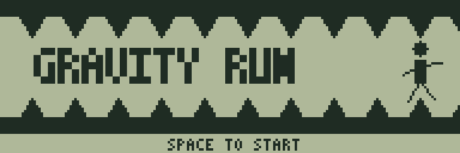
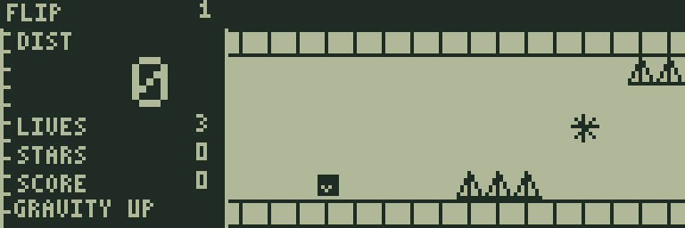
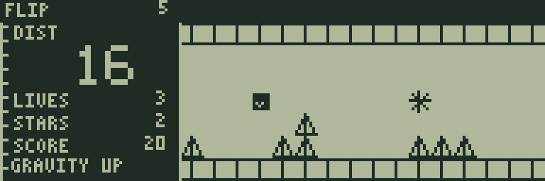
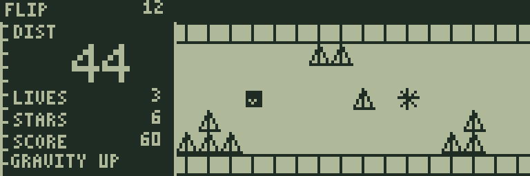

# GRAVITY RUN

[ゲーム一覧](https://github.com/zabaglione/jr800-web-emulator/wiki) / [アクション](https://github.com/zabaglione/jr800-web-emulator/wiki/Genre-Action) · モダン

[遊ぶ](https://zabaglione.github.io/jr800-web-emulator/?program=gravity-run) · [ビルド可能なソース](https://github.com/zabaglione/jr800-web-emulator/tree/main/games/gravity-run)



重力を反転して床と天井の障害物をかわす、全12コースの自動走行アクションです。

## 遊び方

開始位置の点滅と短いジングルの後、自動で走り始めます。走行中にSPACEを押すと重力が反転し、車体が床または天井へ引かれます。1回の進行ごとに縦へ1マス移動するため、反対側へ渡るには4回の進行が必要です。障害物が近づく前に切り替えてください。

上またはW・テンキー8で天井方向、下またはS・テンキー2で床方向を直接指定することもできます。車体の白い印と画面上のGRAVITY UP／GRAVITY DOWNが現在の向きです。左右の移動は自動です。SPACEを押し続けても反転は1回だけで、次の反転には一度キーを離す必要があります。

三角の障害物へ触れるとLIVESを1失います。DISTが32未満なら開始地点、32以降なら中間地点へ戻り、SPACEで再開します。LIVES3を使い切ると失敗です。DISTが64になると右側にCLEARを表示し、走行を止めずに次のコースへ進みます。12コース目の後は1コース目へ続きます。

星は1個10点で、クリアすると100点が加わります。星をすべて取る必要はありません。一度取った星は落下後も取得済みのままで、二重に得点できません。左側のSCOREが得点です。得点と残機は次のコースへ引き継ぎます。序盤から低い障害物、上下の棚、中央を塞ぐ障害物、段状の突起がコースごとに切り替わります。後半ほど進行間隔も短くなります。画面は車体の上下移動に合わせて少し縦にも動きます。

RETURNでメニューを開くと停止します。PAUSEはメニューを閉じた後も停止を保ち、SPACEで再開します。RESETとRETRYは星と得点も含めて、そのコースの最初からやり直します。12コースは開始時のSTAGE画面で選べます。

ゲーム開始時は、自分の位置が効果音とともに短く点滅します。

## ゲーム画面



障害物と星が近づく開始地点。



重力を切り替えて通路を横断。



後半の障害物の間を通り抜ける。

## プレイ動画

[プレイ動画を見る（36秒・音声あり）](https://zabaglione.github.io/jr800-web-emulator/videos/#gravity-run)

通常速度で操作と演出を確認できます。再生・一時停止・シークは動画ページで操作できます。

## 共通操作

| 操作 | キー |
|---|---|
| 上・下・左・右 | テンキー8・2・4・6、またはW・S・A・D |
| 決定・開始・主要アクション | SPACE |
| 取消・戻る・操作メニュー | RETURN |
| BASICへ終了 | BREAK |

メニューを開いている間はゲームが停止します。決定・取消は押した瞬間だけ反応し、移動だけ長押しできます。

クリア後は解き終えた盤面をしばらく残し、ジングルと余韻の後に結果を表示します。続行案内が出てからSPACEを押してください。押しっぱなしでは次へ進みません。

## 確認済み環境

JR-HuBASIC 1.0を使ったWebエミュレーターで確認しています。ゲームは標準16KB RAM内に収まり、拡張RAMなしのNative/WASM再生でも検証しています。ブラウザーのBASIC起動には既存のBASIC実験プロファイルを使用します。2.0は対応未確認です。実機動作・カセット転送・実機のLCD応答と音は未検証です。

BREAKで戻る際には、以前のBASICプログラムと変数が消去されます。必要な内容はゲームを読み込む前に保存してください。途中経過はエミュレーターの汎用状態保存で保存できます。ROMとROM入り状態ファイルは配布しません。

## ビルド

```sh
make -C games/gravity-run
make -C games/gravity-run test
```

環境の準備・一括ビルドは[Games README](https://github.com/zabaglione/jr800-web-emulator/tree/main/games)を参照してください。画像とマップを含む新規制作物はMIT Licenseです。
