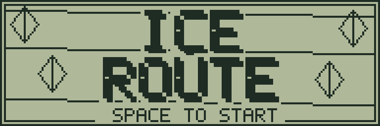
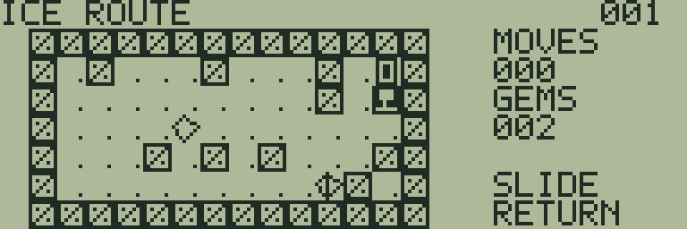
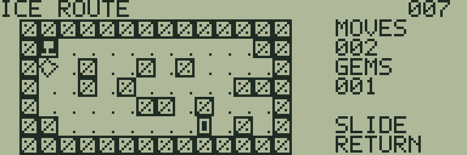
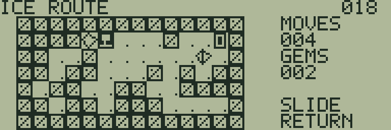

# ICE ROUTE

[ゲーム一覧](https://github.com/zabaglione/jr800-web-emulator/wiki) / [パズル・論理](https://github.com/zabaglione/jr800-web-emulator/wiki/Genre-Logic) · モダン

[ビルド可能なソース](https://github.com/zabaglione/jr800-web-emulator/tree/main/games/ice-route)



壁に当たるまで滑る氷の迷路で、2つの結晶を回収して出口を目指す全20面のパズルです。

## 遊び方

方向キーを押すと、その方向の壁まで滑ります。途中の結晶は自動で回収します。GEMSが0の状態で扉に到達するとクリアです。結晶が残っている間は扉を通過します。SPACEはメニューの決定に使います。

RETURNからUNDOで直前の滑走と結晶回収を戻せます。RESETまたはRETRYで同じ面をやり直します。MOVESは滑走回数（最大255）です。壁に向かう無効な入力は手数に数えません。

## ゲーム画面



結晶と出口が点在する最初の氷の迷路。



第7面で滑走経路を選ぶ場面。



第18面の複雑な停止位置。

## 共通操作

| 操作 | キー |
|---|---|
| 上・下・左・右 | テンキー8・2・4・6、またはW・S・A・D |
| 決定・開始・主要アクション | SPACE |
| 取消・戻る・操作メニュー | RETURN |
| BASICへ終了 | BREAK |

メニューを開いている間はゲームが停止します。決定・取消は押した瞬間だけ反応し、移動だけ長押しできます。

## 確認済み環境

JR-HuBASIC 1.0を使ったWebエミュレーターで確認しています。ゲームは標準16KB RAM内に収まり、拡張RAMなしのNative/WASM再生でも検証しています。ブラウザーのBASIC起動には既存のBASIC実験プロファイルを使用します。2.0は対応未確認です。実機動作・カセット転送・実機のLCD応答と音は未検証です。

BREAKで戻る際には、以前のBASICプログラムと変数が消去されます。必要な内容はゲームを読み込む前に保存してください。途中経過はエミュレーターの汎用状態保存で保存できます。ROMとROM入り状態ファイルは配布しません。

## ビルド

```sh
make -C games/ice-route
make -C games/ice-route test
```

環境の準備・一括ビルドは[Games README](https://github.com/zabaglione/jr800-web-emulator/tree/main/games)を参照してください。画像とマップを含む新規制作物はMIT Licenseです。
