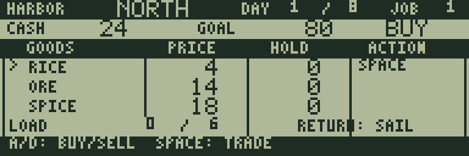
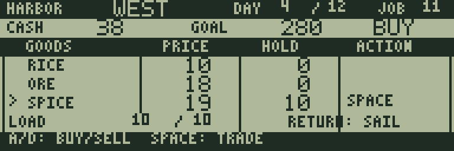

# MARKET HARBOR

[ゲーム一覧](https://github.com/zabaglione/jr800-web-emulator/wiki) / [経営・シミュレーション](https://github.com/zabaglione/jr800-web-emulator/wiki/Genre-Simulation) · 定番

[遊ぶ](https://zabaglione.github.io/jr800-web-emulator/?program=market-harbor) · [ビルド可能なソース](https://github.com/zabaglione/jr800-web-emulator/tree/main/games/market-harbor)


4つの港で米・鉱石・香辛料を売買し、運賃と積載量を考えて資金を増やす全12課題の交易ゲームです。

## 遊び方

取引画面では上／下（8／2、W／S）で商品を選び、左（4、A）でBUY、右（6、D）でSELLを選びます。SPACEで1個を売買します。RICEは米、OREは鉱石、SPICEは香辛料です。PRICEは現在の価格、HOLDはその商品の所持数、LOADは合計積載数／上限です。資金不足・満載・在庫なしの場合は取引せず、資金や荷物を変更しません。

RETURNのメニューからSAILを選ぶと出航先の一覧を開きます。方向キーで港を選び、SPACEで出航、RETURNで取り消します。一覧の価格は各港へ到着する日の価格です。DAYSが日数、FAREが運賃、CASHが現在の所持金です。同じ港を選ぶと取引画面へ戻り、日数と運賃はかかりません。

港はNORTH・EAST・SOUTH・WESTの順に輪でつながり、隣の港は1日、反対側は2日かかります。運賃は1日あたり2コインです。価格は港・商品・日付によって変化します。同じ日の同じ港では買値と売値は同じです。出航の取消では日数・資金・荷物は変わりません。

運賃が足りないとNOT ENOUGH CASH FOR FAREと表示し、出航しません。取り消して商品を売り、運賃を確保してください。RETURNのSELL ALLは現在の港で全商品を売却します。売買は日数を消費しないので、混載の積荷を調整してから出航できます。

GOAL以上の現金を得る売却でクリアします。商品の評価額は目標に含めません。DAYは現在の日／最終日です。期限を超える出航を確定するとTIME LIMIT、到着後に積荷がなく現金も2未満になるとOUT OF CASHで失敗します。

課題1〜4は容量6・期限8日、5〜8は容量8・期限10日、9〜12は容量10・期限12日です。目標は80から20刻みで300まで、初期資金は課題順に24・28・32を繰り返します。右上は課題番号です。RETURNのRETRYでやり直し、失敗画面ではSPACEで再挑戦します。全12課題は開始時のSTAGE画面で選べます。

## ゲーム画面



港の相場と積載量を見て売買する。


到着日の価格と運賃を比べて出航先を選ぶ。



仕入れた積荷を売り、現金の目標へ近づく。

## 共通操作

| 操作 | キー |
|---|---|
| 上・下・左・右 | テンキー8・2・4・6、またはW・S・A・D |
| 決定・開始・主要アクション | SPACE |
| 取消・戻る・操作メニュー | RETURN |
| BASICへ終了 | BREAK |

メニューを開いている間はゲームが停止します。決定・取消は押した瞬間だけ反応し、移動だけ長押しできます。

## 確認済み環境

JR-HuBASIC 1.0を使ったWebエミュレーターで確認しています。ゲームは標準16KB RAM内に収まり、拡張RAMなしのNative/WASM再生でも検証しています。ブラウザーのBASIC起動には既存のBASIC実験プロファイルを使用します。2.0は対応未確認です。実機動作・カセット転送・実機のLCD応答と音は未検証です。

BREAKで戻る際には、以前のBASICプログラムと変数が消去されます。必要な内容はゲームを読み込む前に保存してください。途中経過はエミュレーターの汎用状態保存で保存できます。ROMとROM入り状態ファイルは配布しません。

## ビルド

```sh
make -C games/market-harbor
make -C games/market-harbor test
```

環境の準備・一括ビルドは[Games README](https://github.com/zabaglione/jr800-web-emulator/tree/main/games)を参照してください。画像とマップを含む新規制作物はMIT Licenseです。
