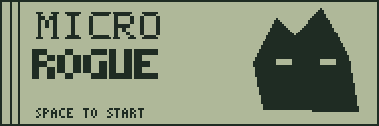
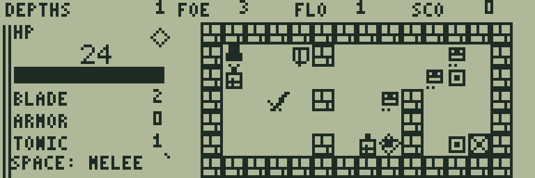
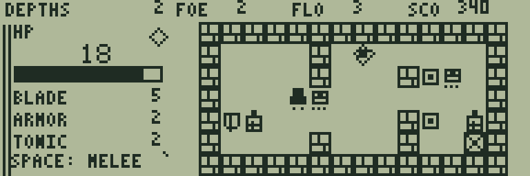
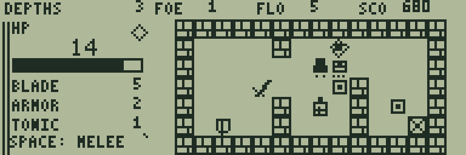

# MICRO ROGUE

[ゲーム一覧](https://github.com/zabaglione/jr800-web-emulator/wiki) / [探索・冒険](https://github.com/zabaglione/jr800-web-emulator/wiki/Genre-Adventure) · 定番

[遊ぶ](https://zabaglione.github.io/jr800-web-emulator/?program=micro-rogue) · [ビルド可能なソース](https://github.com/zabaglione/jr800-web-emulator/tree/main/games/micro-rogue)



地形と配置が変わる5階のダンジョンを、装備と回復薬を集めて踏破する小さなローグライクです。

## 遊び方

テンキー2468またはWASDで移動します。敵へ向かって移動すると、その場で近接攻撃します。SPACEは回復薬を1本使い、HPを8回復します。満タンまたは薬がないときは消費しません。敵に隣接して使うと回復後に反撃されるため、残り体力を見て判断してください。

移動・攻撃・有効な回復・メニューのWAITで1手が進みます。敵は通路に沿った距離6以内で追跡します。手番の開始時に隣接していれば攻撃し、その手番で近づいてきた敵は次の手まで攻撃しません。敵同士は重ならず、倒した敵は反撃しません。壁へぶつかる操作や待機中は手が進みません。

剣を拾うと攻撃力が1増えて上限5、盾は防御力が1増えて上限2です。GEARの左が攻撃力、右が防御力です。薬は最大5本を持てます。満杯の薬はその場に残り、剣と盾は上限でも拾うと消えます。通常の敵の攻撃力は階に応じて2〜4、最終階の強敵は5で、防御力を引いても最低1ダメージを受けます。敵の下の点は体力の目安（1点は残り1、2点は2〜3、3点は4以上）です。

各階の菱形のレリックを回収し、FOESを0にすると階段の×印が横線に変わります。そこへ進むと次の階です。5階目には強敵が登場します。HPと装備・薬を引き継ぎ、JR-800側の乱数で12種類の地形から各階を選びます。同じ地形が続くこともあります。

敵は20点、レリック100点、四角いコインは10点、最終クリア時にHP×5点が加算されます。上部のFLOは現在の階、SCOは得点です。左側のHPゲージは現在の最大HPに対する残量です。難易度1〜3の最大HPは24・20・16で、難易度2・3は通常の敵のHPも1増えます。

RETURNで停止メニューを開きます。WAITで1手待機し、RESETとRETRYは装備も含めて1階からやり直します。失敗画面ではSPACEで再挑戦します。開始時のDIFFICULTY画面で難易度を選べます。

## ゲーム画面



装備と薬を拾い、追跡する敵に備える。



3階で強化した装備を使って戦う。



最終階で残った強敵と向き合う。

## 共通操作

| 操作 | キー |
|---|---|
| 上・下・左・右 | テンキー8・2・4・6、またはW・S・A・D |
| 決定・開始・主要アクション | SPACE |
| 取消・戻る・操作メニュー | RETURN |
| BASICへ終了 | BREAK |

メニューを開いている間はゲームが停止します。決定・取消は押した瞬間だけ反応し、移動だけ長押しできます。

## 確認済み環境

JR-HuBASIC 1.0を使ったWebエミュレーターで確認しています。ゲームは標準16KB RAM内に収まり、拡張RAMなしのNative/WASM再生でも検証しています。ブラウザーのBASIC起動には既存のBASIC実験プロファイルを使用します。2.0は対応未確認です。実機動作・カセット転送・実機のLCD応答と音は未検証です。

BREAKで戻る際には、以前のBASICプログラムと変数が消去されます。必要な内容はゲームを読み込む前に保存してください。途中経過はエミュレーターの汎用状態保存で保存できます。ROMとROM入り状態ファイルは配布しません。

## ビルド

```sh
make -C games/micro-rogue
make -C games/micro-rogue test
```

環境の準備・一括ビルドは[Games README](https://github.com/zabaglione/jr800-web-emulator/tree/main/games)を参照してください。画像とマップを含む新規制作物はMIT Licenseです。
