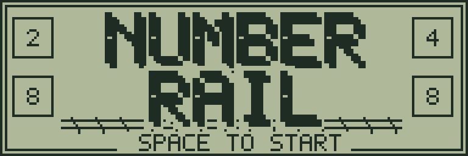
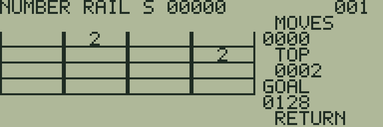
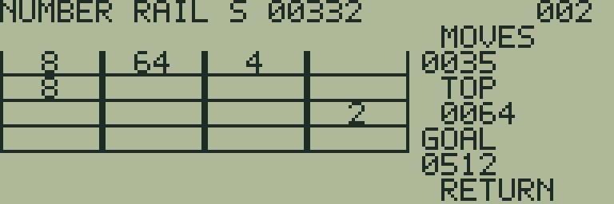
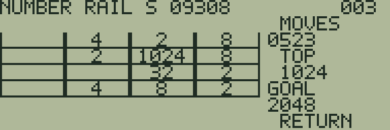

# NUMBER RAIL

[ゲーム一覧](https://github.com/zabaglione/jr800-web-emulator/wiki) / [パズル・論理](https://github.com/zabaglione/jr800-web-emulator/wiki/Genre-Logic) · モダン

[ビルド可能なソース](https://github.com/zabaglione/jr800-web-emulator/tree/main/games/number-rail)



同じ数字を合流させて大きくする4×4のパズルです。128・512・2048の3段階の目標を選べます。

## 遊び方

方向キーで盤面全体をその方向へ滑らせます。同じ数字が接触すると1回だけ合流し、2倍の数字になります。たとえば2・2・2・2を寄せると4・4になり、その操作だけで8にはなりません。盤面が動いたときだけ、新しい2または4が1個現れます。

TOPは最大の数字、GOALは目標です。難易度1は128、2は512、3は2048を目指します。目標を作ればクリア、空きマスも合流できる組合せもなくなると終了です。上部のSは合流してできた数字の合計点です。

RETURNのUNDOで1手戻せます。得点・手数・乱数の状態も戻すため、同じ方向へ再び動かすと同じ位置に同じ数字が出ます。動かない操作では前のUNDOを失いません。RESETは新しい初期配置でやり直します。手数は9999、得点は65535で表示の上限になります。

## ゲーム画面



2つの数字から始める初期配置。



64を作り次の合流を考える。



1024を作って2048を目指す終盤。

## 共通操作

| 操作 | キー |
|---|---|
| 上・下・左・右 | テンキー8・2・4・6、またはW・S・A・D |
| 決定・開始・主要アクション | SPACE |
| 取消・戻る・操作メニュー | RETURN |
| BASICへ終了 | BREAK |

メニューを開いている間はゲームが停止します。決定・取消は押した瞬間だけ反応し、移動だけ長押しできます。

## 確認済み環境

JR-HuBASIC 1.0を使ったWebエミュレーターで確認しています。ゲームは標準16KB RAM内に収まり、拡張RAMなしのNative/WASM再生でも検証しています。ブラウザーのBASIC起動には既存のBASIC実験プロファイルを使用します。2.0は対応未確認です。実機動作・カセット転送・実機のLCD応答と音は未検証です。

BREAKで戻る際には、以前のBASICプログラムと変数が消去されます。必要な内容はゲームを読み込む前に保存してください。途中経過はエミュレーターの汎用状態保存で保存できます。ROMとROM入り状態ファイルは配布しません。

## ビルド

```sh
make -C games/number-rail
make -C games/number-rail test
```

環境の準備・一括ビルドは[Games README](https://github.com/zabaglione/jr800-web-emulator/tree/main/games)を参照してください。画像とマップを含む新規制作物はMIT Licenseです。
