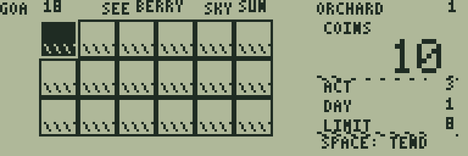
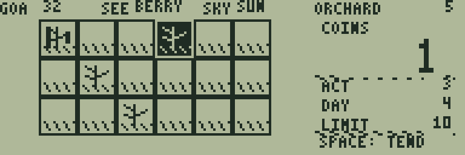
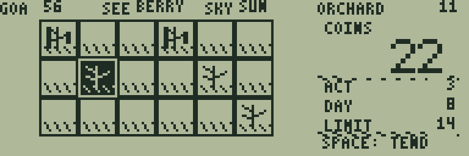

# ORCHARD DAYS

[ゲーム一覧](https://github.com/zabaglione/jr800-web-emulator/wiki) / [経営・シミュレーション](https://github.com/zabaglione/jr800-web-emulator/wiki/Genre-Simulation) · モダン

[遊ぶ](https://zabaglione.github.io/jr800-web-emulator/?program=orchard-days) · [ビルド可能なソース](https://github.com/zabaglione/jr800-web-emulator/tree/main/games/orchard-days)


1日3回の作業で豆とベリーを育て、期限までの所持金目標を目指す全12課題の農園ゲームです。

## 遊び方

テンキー2468またはWASDで18区画から作業場所を選び、SPACEで作業します。空の区画では種まき、成長途中では水やり、実った作物では収穫になります。方向キーによる選択に作業回数は使いません。

所持金COINSは10、1日の作業回数ACTは3で始まります。BEANは種2コイン・売値7コイン・成長に3回の夜、BERRYは種3コイン・売値12コイン・成長に5回の夜が必要です。RETURNのSWAP SEEDで種を切り替えます。種の選択には作業回数も所持金も使いません。

種まき直後は水やり済みです。画面上部がSUNの日は、水やり済みの成長途中の作物だけが夜に1段階育ちます。RAINの日は全区画が雨で育つため、夜に備える水やりを省けます。土の下の横線は水やり済みの印です。実った作物は水やりなしで待てます。

成長途中の作物が2夜続けて乾燥すると枯れます。右上の小さな×は1夜乾燥した警告です。水やりか雨で乾燥の回数が戻ります。すでに水やり済みの区画、作業回数0、種代不足では作業回数も所持金も減りません。

RETURNのNEXT DAYでその日の作業を終え、夜の成長を処理して翌日のACTを3に戻します。右側のDAYは現在の日、LIMITは最終日です。上部のSKYが天候、右上の数字が課題番号です。GOAL以上の所持金になる収穫でクリアします。最終日にNEXT DAYを選ぶと、目標未達の場合は失敗です。使わなかった作業回数は繰り越せません。

課題1〜12の「最終日／目標」は8／18、8／22、9／25、9／28、10／32、10／36、11／40、11／44、12／48、12／52、14／56、14／60です。何も押していない間やメニュー中に日は進みません。RETURNのRETRYで課題を最初からやり直せます。失敗画面ではSPACEで再挑戦します。全12課題は開始時のSTAGE画面で選べます。

## ゲーム画面



18区画から種をまく場所を選ぶ。



作物の成長と水やりを計画する。



豆とベリーを収穫して所持金目標へ近づく。

## 共通操作

| 操作 | キー |
|---|---|
| 上・下・左・右 | テンキー8・2・4・6、またはW・S・A・D |
| 決定・開始・主要アクション | SPACE |
| 取消・戻る・操作メニュー | RETURN |
| BASICへ終了 | BREAK |

メニューを開いている間はゲームが停止します。決定・取消は押した瞬間だけ反応し、移動だけ長押しできます。

## 確認済み環境

JR-HuBASIC 1.0を使ったWebエミュレーターで確認しています。ゲームは標準16KB RAM内に収まり、拡張RAMなしのNative/WASM再生でも検証しています。ブラウザーのBASIC起動には既存のBASIC実験プロファイルを使用します。2.0は対応未確認です。実機動作・カセット転送・実機のLCD応答と音は未検証です。

BREAKで戻る際には、以前のBASICプログラムと変数が消去されます。必要な内容はゲームを読み込む前に保存してください。途中経過はエミュレーターの汎用状態保存で保存できます。ROMとROM入り状態ファイルは配布しません。

## ビルド

```sh
make -C games/orchard-days
make -C games/orchard-days test
```

環境の準備・一括ビルドは[Games README](https://github.com/zabaglione/jr800-web-emulator/tree/main/games)を参照してください。画像とマップを含む新規制作物はMIT Licenseです。
