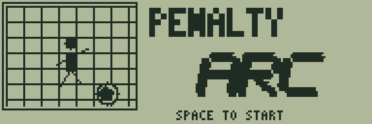
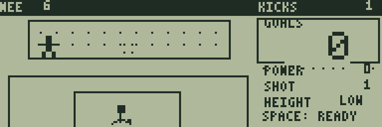
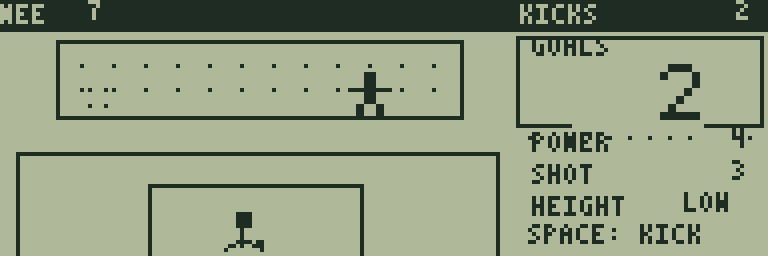
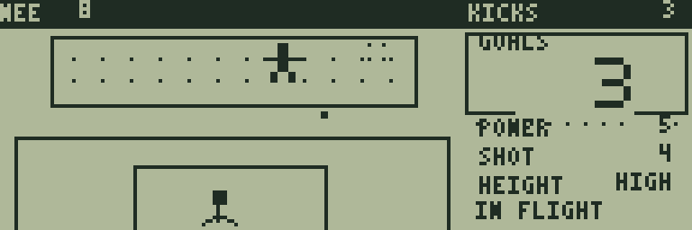

# PENALTY ARC

[ゲーム一覧](https://github.com/zabaglione/jr800-web-emulator/wiki) / [スポーツ・タイミング](https://github.com/zabaglione/jr800-web-emulator/wiki/Genre-Sports) · 定番

[遊ぶ](https://zabaglione.github.io/jr800-web-emulator/?program=penalty-arc) · [ビルド可能なソース](https://github.com/zabaglione/jr800-web-emulator/tree/main/games/penalty-arc)



コース・高さ・強さと、動くキーパーの位置を見て蹴るタイミングを選ぶPKゲームです。10本のシュートで規定のゴール数を目指します。

## 遊び方

READYでは左／右（4／6、A／D）で5つのコースを選び、上（8、W）でHIGH、下（2、S）でLOWを選びます。ゴール内の四隅の印が狙う場所です。SPACEを1回押すとPOWERの数値とキーパーが動き始め、次のSPACEでその瞬間の強さを確定して蹴ります。長押しでは連続決定しません。強さを溜めている間もコースと高さを変更できます。

LOWの有効なPOWERは4〜7、HIGHは5〜6です。この範囲を外すとWIDEになります。HIGHは狙える強さの幅が狭い代わりに、キーパーが届く横幅も狭くなります。キーパーから遠い側を狙い、数値が適正な範囲に入るタイミングを待ってください。

蹴った球はIN FLIGHTと表示されている間にゴールへ進みます。キーパーは最初の少しの間は左右移動を続け、その後、蹴られたコースへ飛び込みます。到達したときにGOAL・SAVE・WIDEを表示します。結果を見てSPACEを押すと次のシュートのREADYへ戻ります。

SHOTは現在のシュート番号、GOALSは決まった本数、上部のNEEは必要本数です。難易度1は6本、2は7本、3は8本以上でクリアします。難易度を上げるとキーパーの左右移動と飛び込みが速くなります。10本を終えた時点で判定します。

RETURNのメニューではPOWER・キーパー・球が止まります。CANCELはPOWERを溜めている状態だけを取り消し、シュートを消費せずREADYへ戻します。飛行中と結果表示中は取り消せません。RESETまたはRETRYで10本の挑戦を最初からやり直します。失敗画面のSPACEで再挑戦、クリア後のSPACEで次の難易度へ進みます。

## ゲーム画面



5つのコースと高低を選び、SPACEで強さの計測を始める。



キーパーの位置とPOWERを見て蹴る瞬間を選ぶ。



飛び込むキーパーをかわしてゴールを狙う。

## 共通操作

| 操作 | キー |
|---|---|
| 上・下・左・右 | テンキー8・2・4・6、またはW・S・A・D |
| 決定・開始・主要アクション | SPACE |
| 取消・戻る・操作メニュー | RETURN |
| BASICへ終了 | BREAK |

メニューを開いている間はゲームが停止します。決定・取消は押した瞬間だけ反応し、移動だけ長押しできます。

## 確認済み環境

JR-HuBASIC 1.0を使ったWebエミュレーターで確認しています。ゲームは標準16KB RAM内に収まり、拡張RAMなしのNative/WASM再生でも検証しています。ブラウザーのBASIC起動には既存のBASIC実験プロファイルを使用します。2.0は対応未確認です。実機動作・カセット転送・実機のLCD応答と音は未検証です。

BREAKで戻る際には、以前のBASICプログラムと変数が消去されます。必要な内容はゲームを読み込む前に保存してください。途中経過はエミュレーターの汎用状態保存で保存できます。ROMとROM入り状態ファイルは配布しません。

## ビルド

```sh
make -C games/penalty-arc
make -C games/penalty-arc test
```

環境の準備・一括ビルドは[Games README](https://github.com/zabaglione/jr800-web-emulator/tree/main/games)を参照してください。画像とマップを含む新規制作物はMIT Licenseです。
