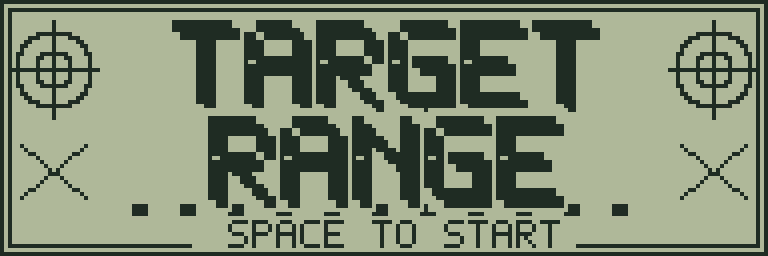
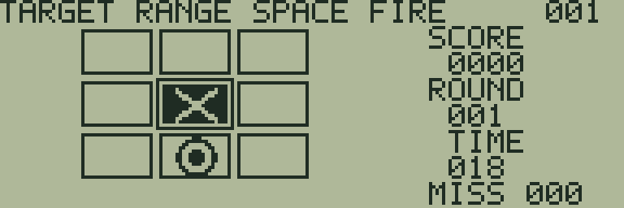
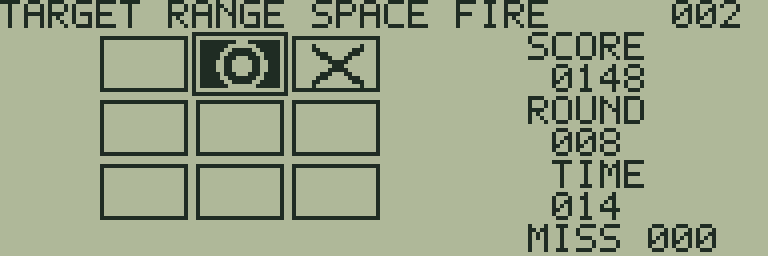
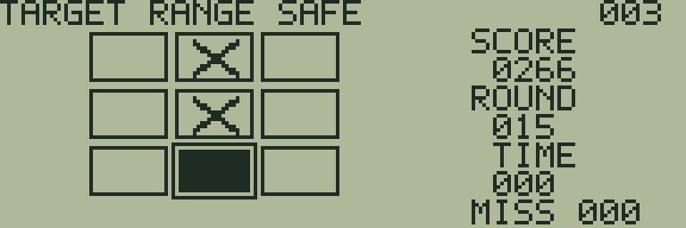

# TARGET RANGE

[ゲーム一覧](https://github.com/zabaglione/jr800-web-emulator/wiki) / [シューティング](https://github.com/zabaglione/jr800-web-emulator/wiki/Genre-Shooting) · 定番

[ビルド可能なソース](https://github.com/zabaglione/jr800-web-emulator/tree/main/games/target-range)



丸い標的を撃ち、バツ印は見送る、20回の判断で得点を目指す射撃ゲームです。3段階の難易度があります。

## 遊び方

SPACEで始めると、9枚のパネルに標的が現れます。方向キーで照準を動かし、丸い標的に合わせてSPACEを押してください。白黒が反転したパネルが現在の照準です。早く撃つほど命中の得点が増えます。

大きなバツ印は撃ってはいけません。バツ印しか出ない回は、何も撃たずにTIMEが尽きるまで待つとSAFEになり、10点が入ります。丸い標的を時間内に撃てなければMISS、別のパネルを撃つとWRONGで、どちらもミスが1増えます。ミス3回で失敗です。

1回の命中後や時間切れの後は短く結果を表示し、次の標的に切り替わります。標的を表示し終えてから制限時間が進みます。SPACEを押し続けても次の標的を自動で撃つことはありません。

20回を終えた時点で、初級180点、中級220点、上級250点に届けばクリアです。ミスが3回未満でも、目標点に届かなければ失敗します。難易度が上がるほど制限時間が短くなります。命中は基本10点に残り時間のボーナスが加わります。

RETURNでメニューを開くと残り時間を保って停止します。RETRYとRESETは得点・ミス・提示回数を最初に戻します。開始時のDIFFICULTY画面で3段階を選べます。

## ゲーム画面



9枚のパネルから照準を選ぶ。



丸い標的へ照準を合わせる。



バツ印を見送ってSAFEを得る。

## 共通操作

| 操作 | キー |
|---|---|
| 上・下・左・右 | テンキー8・2・4・6、またはW・S・A・D |
| 決定・開始・主要アクション | SPACE |
| 取消・戻る・操作メニュー | RETURN |
| BASICへ終了 | BREAK |

メニューを開いている間はゲームが停止します。決定・取消は押した瞬間だけ反応し、移動だけ長押しできます。

## 確認済み環境

JR-HuBASIC 1.0を使ったWebエミュレーターで確認しています。ゲームは標準16KB RAM内に収まり、拡張RAMなしのNative/WASM再生でも検証しています。ブラウザーのBASIC起動には既存のBASIC実験プロファイルを使用します。2.0は対応未確認です。実機動作・カセット転送・実機のLCD応答と音は未検証です。

BREAKで戻る際には、以前のBASICプログラムと変数が消去されます。必要な内容はゲームを読み込む前に保存してください。途中経過はエミュレーターの汎用状態保存で保存できます。ROMとROM入り状態ファイルは配布しません。

## ビルド

```sh
make -C games/target-range
make -C games/target-range test
```

環境の準備・一括ビルドは[Games README](https://github.com/zabaglione/jr800-web-emulator/tree/main/games)を参照してください。画像とマップを含む新規制作物はMIT Licenseです。
