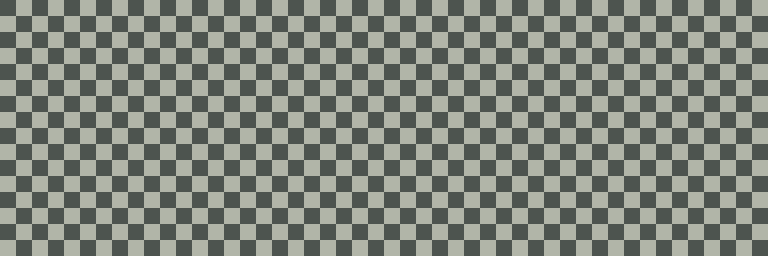

# 02 市松模様を描く



192×64ドットの全画面に、4×4ドットの市松模様を描きます。
キー操作はありません。
[共通の起動手順](../README.md)で`02-checkerboard.j8a`を読み込んでください。

## プログラムの仕組み

[main.s](main.s)はフレームバッファーへ`$0F`を4バイト書き、続けて`$F0`を4バイト書く処理を繰り返します。
1バイトは縦8ドットなので、`$0F`では上半分の4ドット、`$F0`では下半分の4ドットが点灯します。
同じ値を横4列へ書くことで、正方形のタイルになります。

```asm
    EORA #$FF
    DECB
    BNE column
```

`EORA`はAと指定値の排他的論理和を取ります。
`$FF`との排他的論理和は全ビットの反転なので、Aは`$0F`と`$F0`を交互に取ります。
Bは1段の残りグループ数です。
横192列を4列ずつ処理するため、初期値は48です。

Xを1バイトずつ進め、1段を書き終えたら次の段へ進みます。
`CPX #framebuffer + 1536`で画面末尾を判定し、最後に`present`でLCDへ転送します。

## 動作確認と変更例

```sh
make
make run
make test
```

`make test`は全12,288ドットについて、座標から求めた市松模様と一致するか調べます。
点灯数と消灯数はそれぞれ6,144です。
LCDコントローラー間の継ぎ目と上下32ドットの境界も、同じ検査に含まれます。

練習では最初の値`$0F`を`$55`へ変えてください。
2進数で`01010101`になるため、縦方向の明暗が1ドットごとに切り替わります。
画面の規則を変えると元の`make test`は失敗するので、実験結果は`make run`で確認します。
