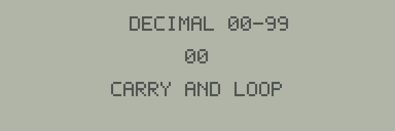

# 03 10進カウンターを作る



画面中央の数値が`00`から`99`へ増え、次に`00`へ戻ります。
キー操作はありません。
[共通の起動手順](../README.md)で`03-counter.j8a`を読み込み、数値の更新を確認してください。

## プログラムの仕組み

[main.s](main.s)では、1の位を`ones`、10の位を`tens`という別々の1バイト変数で持ちます。
どちらも値は0〜9です。
表示時はそれぞれに48を足してASCIIの数字コードに変え、`glyph`で1文字ずつ描きます。

```asm
    INC ones
    LDAA ones
    CMPA #10
    BNE render
```

`INC`で1の位を増やし、`CMPA #10`で10に達したか調べます。
まだ10でなければ、そのまま描画へ戻ります。
10になった場合は1の位を0へ戻し、10の位を1増やします。
10の位も10になったときは0へ戻すので、`99`の次は`00`です。

タイトルは初回だけ描き、繰り返し処理では中央の2文字だけを書き直します。
各字形は空白も含む6列を上書きするため、前の数字のドットは残りません。
`present`によるLCD転送後に`delay`を呼び、更新を目で追えるようにしています。
更新速度は描画命令の実行時間も含むため、時計としての秒数は表しません。

## 動作確認と変更例

```sh
make
make run
make test
```

`make test`は101画面を実行し、`00–99–00`の全数値と表示字形を検査します。
したがって`09→10`の桁上がりと`99→00`の繰り返しも確認できます。

練習では初期値を`ones=8, tens=9`へ変え、`98→99→00`を観察してください。
初期値の変更後は`make run`とWeb UIで確認します。
テストを更新する場合は、最初の数値だけでなく、繰り返し後の数値も検査対象にしてください。
