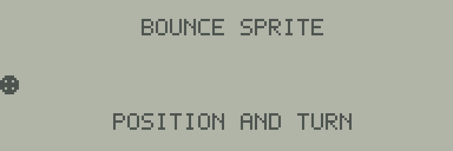

# 04 図形を左右に跳ね返す



8×8ドットの図形が左から右へ進み、画面端で反転して往復します。
このように位置を変えて表示する小さな図形を、ここでは**スプライト**と呼びます。
[共通の起動手順](../README.md)でビルドしたサンプルを読み込んでください。

## プログラムの仕組み

[main.s](main.s)は、横座標を`position`、移動方向を`direction`で管理します。
方向が0なら右へ、1なら左へ、1回の更新で4ドット移動します。
縦位置は32ドットに固定しています。

図形の幅は8ドットなので、左端の横座標の範囲は0〜184です。
右端では`184 + 7 = 191`となり、最後の列へちょうど収まります。

```asm
    LDX #framebuffer + 768
    LDAB position
    ABX
```

`768 = 192 × 4`は縦8ドットの段を4つ下げる指定です。
`ABX`はBの値をXへ加える命令なので、Xは図形の描画先を指します。
そこから8バイトを書き込み、縦8ドット、横8ドットの図形を作ります。

各更新の前に、この段の192バイトをゼロにします。
その後に新しい位置へ描くため、通過した場所に図形が残りません。
上下のタイトルと説明は別の段なので消えません。
これはソフトウェアによる描画で、専用スプライト回路は使用しません。

## 動作確認と変更例

```sh
make
make run
make test
```

`make test`は95画面を実行し、右端の反転、左端への帰還、再び右へ進む動作を確認します。
各画面で横座標と8列の図形を調べ、段内の残りの列がすべて消えていることも検査します。

練習では移動量を4から2へ変えてください。
右へ進む`ADDA #4`と左へ進む`SUBA #4`の両方を変更します。
2は184を割り切るため、現在の端の等値判定を使えます。
割り切れない移動量を使う場合は、端を通り越したときの処理も設計する必要があります。

BREAKキーでBASICへ戻ります（JR-HuBASIC 1.0）。終了時にBASICのプログラムと変数を初期化します。
