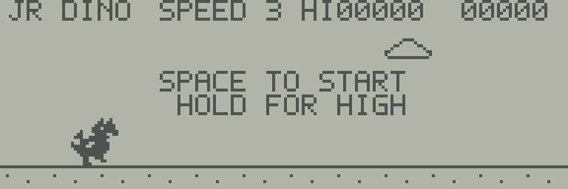

# JR DINO



SPACEで恐竜をジャンプさせ、右から来るサボテンを避けるJR-800用の機械語ゲームです。
Chrome Dinoを参考に、192×64ドットのLCDで遊べる大きさと速度に合わせました。
ローカルのエミュレーターで起動すれば、ネット接続なしで遊べます。

## 遊び方

| 場面 | SPACEの操作 |
| --- | --- |
| 開始画面 | 押すとゲームが始まり、ジャンプする |
| 走行中 | 地面にいるときに押すとジャンプする |
| 空中 | 追加のジャンプはできない |
| GAME OVER | 一度キーを離し、押し直すと再挑戦する |

SPACEを押しっぱなしにしても、着地後に自動ではジャンプしません。
PCのSPACEキーと、エミュレーター画面のSPACEキーを使えます。

右上の数字が今回のスコア、`HI`の数字が現在の実行セッションでの最高スコアです。
4回の更新ごとにスコアが1増え、100点と200点でサボテンの移動が速くなります。
スコアの上限は999です。
最高スコアは再挑戦しても残り、ゲームの再読み込みやエミュレーターの再起動で消えます。

## ビルドして実行する

[共通の準備手順](../README.md)でSDKとWASM版をビルドしてから、リポジトリのルートで実行します。

```sh
make -C sdk/examples/lcd/06-dino
make -C sdk/examples/lcd/06-dino test
python3 -m http.server 8000 --bind 127.0.0.1 --directory build/wasm-release/web
```

ブラウザーで`http://127.0.0.1:8000/`を開き、次の順に操作します。

1. 自分のROMでBASICを起動し、画面が落ち着いたら一時停止します。
2. 通常画面のプログラム選択で`build/sdk-lcd/06-dino/06-dino.j8a`を選びます。
3. 「プログラムの読み込みと実行」を押します。
4. LCDの画面を一度クリックし、SPACEを押します。

このゲームは画面とRAMを専有します。
BASICで作業中の内容は先に保存し、BASICへ戻るときはエミュレーターを再起動してください。

| コマンド | 動作 |
| --- | --- |
| `make` | `.j8a`、`.j8d`、`.map`、`.sym`、`.lst`を生成 |
| `make run` | 最初の画面を実行し、`screen.svg`を出力 |
| `make debug` | 最初の画面で止め、レジスターとシンボルを表示 |
| `make test` | ジャンプ、入力、衝突、加速、スコアを自動検査 |
| `make clean` | ゲームのビルド生成物を削除 |

## ソフトウェアPCGの仕組み

このゲームでは、RAMに保持した書き換え可能なキャラクターパターンを**ソフトウェアPCG**と呼びます。
現在のJR-800エミュレーターには専用のPCG回路モデルはないため、CPUがパターンを読み、LCD用のフレームバッファーへ転送します。
実機に新しいPCG回路があると仮定した実装ではありません。

[pcg.s](pcg.s)には、16×16ドットのパターンを7個収めています。
1列を縦16ドットの2バイトで表すため、1パターンは32バイト、全体で224バイトです。
このデータはプログラムとともに標準RAMへ配置されます。

| パターン | 用途 |
| --- | --- |
| `dino_run_a`、`dino_run_b` | 足を交互に動かす歩行アニメーション |
| `dino_air` | ジャンプ中の恐竜 |
| `dino_dead` | 衝突時の恐竜 |
| `cactus_a`、`cactus_b` | 2種類のサボテン |
| `cloud` | 背景の雲 |

`blit`にはXでパターンの先頭、Aで横座標、Bで縦座標を渡します。
縦座標が8の倍数でなくても、パターンのビットをずらして最大3段へ分けて書くため、恐竜が1ドット単位で上下できます。
背景とは論理和で重ね、左右の画面端をはみ出した列は描きません。
これにより、サボテンが右から入り、左へ抜ける動きも同じ描画処理で扱えます。

パターンの変更箇所は、各ラベルの下に並ぶ`.byte`です。
直前の16行のコメントは字形の見本で、`#`が点灯、`.`が消灯を表します。
コメントだけを変更しても字形は変わりません。
各列の先頭バイトが上8ドット、次のバイトが下8ドットで、下位ビットが上側です。
ソースとパターンは新規作成しており、Chromeの画像やROMの字形データは組み込んでいません。

## ゲーム処理を読む

[main.s](main.s)の`phase`が、開始待ちの0、走行中の1、ゲーム終了の2を表します。
SPACEの押下は現在値と前回値を比較し、新しく押されたときだけイベントとして保持します。
文字や図形の描画中とLCD転送の前後でも入力を読むことで、短いキー入力が画面更新の隙間に落ちにくくしています。

ジャンプ中は整数の高さ`height`と上下速度`velocity`を使います。
上向きの初速を7として、更新ごとに高さへ速度を足し、速度を1減らします。
最高点は28ドットです。
着地時には高さと速度を0へ戻します。
壁時計やブラウザーのタイマーで機械語の状態を動かす処理はありません。

サボテンは初期状態で1更新に3ドット進み、スコアに応じて4、5ドットへ加速します。
画面外へ抜けた後は、短い待ち時間を挟んで次のサボテンを出します。
8ビットの疑似乱数で見た目と待ち時間を変え、常に同じ並びにはならないようにしています。
同じ起動状態と入力列なら、進行は再現できます。

当たり判定には、見た目より少し内側の長方形を使います。
恐竜の判定は横座標28〜37、サボテンの判定はその横座標から3〜11ドット先です。
横方向が重なり、ジャンプの高さが14ドット未満なら衝突します。
尾や字形の空白に触れただけでは衝突しない、遊びやすさを優先した判定です。

## 確認したこと

自動検査は、SDKの合成RAMではなく、通常画面と同じC++製JR-800モデルのWASM版で実行します。

- 歩行2パターンの切り替えと、ジャンプ中のPCGの全ドット。
- ジャンプの放物線、着地、空中での追加ジャンプ防止。
- 押しっぱなしでの連続ジャンプと自動再挑戦の防止。
- 衝突、再挑戦、最高スコアの保持。
- SPACE入力だけで4,050回更新し、2種類のサボテンを回避しながら3段階の速度で継続。
- スコアの999での停止と最高スコア更新。
- 22通りのタイミングで短いSPACE入力を入れ、取りこぼさないこと。
- 検査した各完成画面で、LCDの12,288ドットと描画用RAMの一致、スタックの戻り。

Chromeの通常画面でも、SPACEによるジャンプ、押しっぱなし、衝突、再挑戦、サボテン3個の連続回避を検査します。
再実行にはPlaywrightとChromeを用意し、ローカルサーバーを起動した状態で次を実行してください。

```sh
node tests/browser_dino_test.cjs http://127.0.0.1:8000/ build/sdk-lcd/06-dino
```

最後に自分のROMへのパスを追加すると、BASIC起動後の読込も検査できます。
コマンドラインの自動検査では、`JR800_SAMPLE_ROM`環境変数で指定します。

```sh
JR800_SAMPLE_ROM=/absolute/path/to/your-rom.j8r make -C sdk/examples/lcd/06-dino test
```

結果は生成先の`verification.json`と`browser-verification.json`へ保存します。
テストでは追加で`jump.svg`、`game-over.svg`、ブラウザーの画面画像も出力します。

描画は既存のLCD暫定モデルE-184〜E-186、SPACEはROMから確認されたキー配置E-392に依存します。
SPACEの電気的な実機観測とLCD配線については、既存のU-012、U-011の未確定範囲を引き継ぎます。
今回の確認はエミュレーター上の動作であり、実機やカセット転送の検証は含みません。

参考にしたゲームの特徴は、Googleによる[Chrome Dino開発者へのインタビュー](https://blog.google/products-and-platforms/products/chrome/chrome-dino/)で確認しました。
操作と砂漠のランナーという題材を参考にし、コードとドット絵は独自に作成しています。
