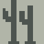
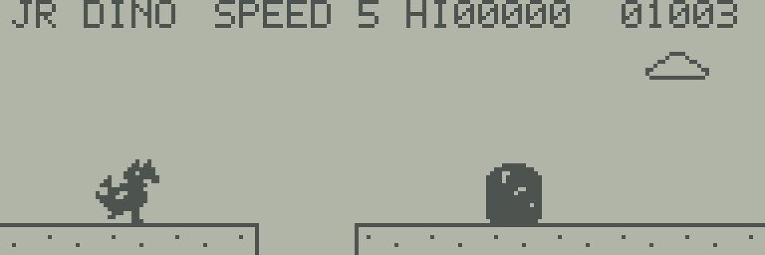

# JR DINO

角と背びれのある、小さなドラゴン風の恐竜が走るゲームです。
使うキーはSPACEだけ。押す長さでジャンプの高さを変え、障害物や穴を飛び越えましょう。
次の障害物も見ながら、どれくらい高く跳ぶか、どこに着地するかを判断します。

  

## 操作

| 操作 | JR-800・Webエミュレーター |
| --- | --- |
| 開始・再挑戦 | SPACEを押す |
| 低いジャンプ | SPACEを短く押して離す |
| 高いジャンプ | SPACEを長めに押す |

上昇中にSPACEを離すと、上向きの勢いが弱まり、低い位置から早く着地します。
押す長さに応じて、中くらいの高さにも調整できます。
空中で押し直してもジャンプはやり直せません。
押したまま着地しても自動では跳ばず、次のジャンプには一度離して押し直す必要があります。
GAME OVERの後も、SPACEを一度離してから押すと再挑戦できます。

Webエミュレーター標準のキー割り当てを使います。
キーが反応しない場合は、LCD画面を一度クリックしてください。
画面上のJR-800キーボードのSPACEでも操作できます。

## 障害物と穴

| 見た目 | 対象 | 対処 |
| --- | --- | --- |
|   | サボテン | 高めのジャンプで越える |
|  | 大岩 | しっかり高さを出して越える。低いジャンプでは衝突する |
|  | 木箱 | 低いジャンプで越えられる。早めに着地して次に備える |
|  | 穴 | 地面が切れた部分を飛び越える。穴の中に着地すると落下して終了 |

すべての障害物と穴は、画面の右端の外から入ってきます。
種類と間隔は変化し、開始・再挑戦まで待った長さによっても、その後の並びが変わります。

穴の先に大岩が近づいているときは、高く跳び過ぎると、次のジャンプを始める前に岩が来てしまいます。
穴の手前から低く跳んで早めに着地し、次は高く跳ぶ、といった使い分けを試してください。
低く跳ぶ場合も、穴の向こうまで届く位置で踏み切ることが大切です。

## 画面の見方

| 表示 | 意味 |
| --- | --- |
| `SPEED` | 今の速度。走行に応じて3段階で速くなる |
| `HI`に続く5桁 | 今の実行セッションでの最高スコア |
| 右端の5桁 | 今回のスコア |

走り続けるとスコアが増え、100点と200点で速度が上がります。
スコアは99999で止まりますが、到達してもゲームは続きます。
最高スコアはゲーム終了時に更新され、再挑戦しても残ります。
ゲームを読み込み直したり、エミュレーターを再起動したりすると消えます。

## 起動する

Webエミュレーター、自分で用意したJR-800のROM、ビルドしたゲームが必要です。
ソースからゲームファイルを作る場合は[ビルド手順](DEVELOPMENT.md#ビルド)を参照してください。

1. Webエミュレーターで自分のROMを使ってBASICを起動し、一時停止します。
2. プログラム選択でビルドしたゲームを選びます。
3. 「プログラムの読み込みと実行」を押します。
4. LCD画面をクリックし、SPACEで始めます。

このゲームはRAMを専有するため、BASICで作業中の内容は先に保存してください。
BREAKキーでBASICへ戻ります（JR-HuBASIC 1.0）。終了時にBASICのプログラムと変数を初期化します。
ブラウザーを閉じて後から続けたい場合は、エミュレーター共通の[状態保存](../../../../docs/user/machine-state.md)を使えます。

## 開発資料・参考作品

PCGの構成、処理の仕組み、検証手順は[開発資料](DEVELOPMENT.md)にまとめています。
動作確認はエミュレーターで行っており、実機では未確認です。

走る恐竜と砂漠という題材はChrome Dinoを参考にしています。
原作についてはGoogleの[開発者インタビュー](https://blog.google/products-and-platforms/products/chrome/chrome-dino/)を参照してください。
コードとドット絵は独自に作成しています。
