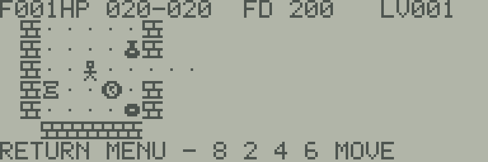

# RELIC DIVE

JR-800向けのターン制迷宮探索ゲームです。
自分が行動すると敵も動きます。
考えている間は時間が進まないので、周囲を見ながら次の一手を選べます。

**階段を降り、最下層の遺物を拾えばクリアです。**
上の階には戻れません。
必要な食料や装備を集めてから降りましょう。
HPが0になると、その冒険は終了します。

## 遊び始める

プレイにはWebエミュレーター、自分で用意したJR-800のROM、ゲームファイル`07-relic-dive.j8a`が必要です。
ソースからゲームファイルを作る手順は[開発・検証資料](DEVELOPMENT.md#ビルド)にまとめています。

1. Webエミュレーターで自分のROMを起動し、一時停止します。
2. 「プログラムの読み込みと実行」で`07-relic-dive.j8a`を読み込みます。
3. LCD画面をクリックしてから、キーを操作します。

タイトル画面でテンキーの`8`・`2`を押して難易度を選び、RETURNまたはEnterで開始します。
難易度の変更は新しい冒険の開始時だけです。

| 難易度 | 最下層 | 初期HP | 初期食料 | 各階の食料 | 食料の回復量 | 回復薬 | 敵の攻撃補正 | 各階の敵数 |
| --- | ---: | ---: | ---: | ---: | ---: | ---: | ---: | ---: |
| EASY | 5階 | 24 | 240 | 2個 | 80 | 12 | −1 | 4〜8体 |
| NORMAL | 10階 | 20 | 200 | 1個 | 60 | 8 | 0 | 6〜15体 |
| HARD | 20階 | 16 | 160 | 1個 | 45 | 6 | ＋1 | 8〜27体 |

初めて遊ぶ場合はEASYで操作と食料の使い方を覚え、NORMALへ進むとよいでしょう。

## 操作

| 操作 | JR-800 | Webエミュレーター |
| --- | --- | --- |
| 上・下・左・右 | テンキー `8`・`2`・`4`・`6` | テンキー `8`・`2`・`4`・`6` |
| 左上・右上・左下・右下 | テンキー `7`・`9`・`1`・`3` | テンキー `7`・`9`・`1`・`3` |
| その場で1ターン待機 | テンキー `5` | テンキー `5` |
| メニューを開く／決定 | RETURN | Enter |
| 戻る／取り消す | SPACE | Space |

Webエミュレーターでは標準のキー割り当てを使います。
PCのテンキーを使用してください。上段の数字キーや矢印キーは、このゲームの移動には使いません。
テンキーがない場合は、エミュレーターの画面上のJR-800キーボードで対応するキーを押せます。
斜め移動は、進行先とその両脇の縦・横のマスが床の場合にできます。
壁の角はすり抜けられません。
敵のいる方向へ進むと、斜めも含めて攻撃します。
攻撃は1回押すごとに1回です。
上下左右の長押し移動は、既に見た安全な通路だけで繰り返します。
敵、分岐、未探索の場所、アイテム、階段、空腹警告があると止まります。
部屋の中での移動や連続攻撃には、方向キーを押し直します。
斜め移動と待機も1回押すごとに1ターンで、長押しでは繰り返しません。

| メニュー | 役割 |
| --- | --- |
| DESCEND - NO RETURN | 階段に乗っているときだけ表示。決定すると次の階へ進む |
| INVENTORY | 6枠の持ち物。品物を選び、使用・装備・破棄を決定する |
| WAIT ONE TURN | その場で1ターン待つ。食料を消費し、敵も行動する |
| INSPECT | 見える範囲の対象を選ぶ。敵のHPと特徴、品物の名前を確認する |
| SUSPEND | ターンを止めて中断する |
| HELP | 基本操作と目的を確認する |

メニューを読む、品物を選ぶ、調べる、取り消す、壁へ進もうとする操作では、ターンは進みません。
破棄は品物の詳細画面で`DISCARD THIS ITEM`を選んで決定します。
地面に別の品物があると破棄できません。

## 画面の見方

画面上部の状態表示（HUD）は階層、HP、食料、レベルを表示し、毒を受けている間は右端に`P`を表示します。
攻撃力、防御力、金はメニューと持ち物画面で確認できます。

画像はゲーム内で使う8×8ドットのPCGデータを拡大したものです。
自分の位置、降りる階段、最下層で探す遺物は次の絵で表示します。

| 画像 | 対象 | 意味 |
| --- | --- | --- |
|  | プレイヤー | 操作している冒険者 |
|  | 壁 | 移動できず、視界も遮る |
|  | 床 | 移動できる場所 |
|  | 下り階段 | 次の階へ降りる。上の階へは戻れない |
|  | 遺物 | 最下層の目的物。拾うとクリア |

## 生き残るためのルール

移動、攻撃、品物の使用、装備、破棄、待機、階段の移動で1ターン進みます。
敵はプレイヤーの行動後に動きます。
攻撃は必ず命中し、ダメージは「攻撃力 − 防御力」、最低1です。
3体倒すごとにレベルが上がり、最大HPと現在HPが2増えます。
上限はレベル32です。

食料は1ターンに1減ります。
食料が残っていれば12ターンごとにHPが1回復し、食料が0なら2ターンごとにHPが1減ります。
残り40以下では警告します。
`5`で待機している間も同じ自然回復が働きます。
敵の行動、毒、空腹も進むため、安全な場所と食料を確保して休みます。

視界は壁に遮られ、上下左右の距離を合計して5マスまでです。
見た地形は記憶しますが、見えていない敵は表示しません。
遠くの敵を発見しても、その場所を離れれば敵は最後に見た位置を目指します。
複数の敵を部屋で同時に相手にせず、通路を使うと被害を抑えられます。

## 敵の違い

深い階ほど種類が増え、5階以降は全12種類が出現候補になります。
表の攻撃力には難易度の補正が入る前の値を示します。

| 画像 | 敵 | HP | 攻撃 | 防御 | 特徴と対処 |
| --- | --- | ---: | ---: | ---: | --- |
|  | SLIME | 4 | 2 | 0 | 2ターンに1回行動。動かない間に距離を取れる |
|  | GOBLIN | 5 | 3 | 0 | 通常の近接攻撃。通路で1体ずつ相手にする |
|  | ORC | 9 | 4 | 1 | 丈夫な近接型。武器の強化が有効 |
|  | WRAITH | 6 | 3 | 0 | 攻撃時に食料を3奪う。長く隣接しない |
|  | RAT | 3 | 2 | 0 | HPは低いが毎ターン接近する |
|  | BAT | 4 | 2 | 0 | ときどき別の方向へ動く。位置を確認して攻撃する |
|  | SKELETON | 7 | 4 | 1 | 防御を持つ攻撃型。複数を同時に相手にしない |
|  | TROLL | 12 | 5 | 1 | 4ターンごとにHPを1回復。戦うなら短期決戦 |
|  | THIEF | 5 | 2 | 0 | 一度だけ金を最大10奪い、その後は逃げる |
|  | SNAKE | 5 | 2 | 0 | 6ターン続く毒。毒は2ターンごとにHPを1減らす |
|  | RUST BEAST | 8 | 2 | 1 | 接触攻撃で防具を1段階傷める。離れてやり過ごす判断も必要 |
|  | CENTAUR | 10 | 4 | 0 | 視界内の同じ縦横の列へ射撃。角を曲がって射線を切る |

蛇の毒は回復薬で解除できます。
防具が最低段階からさらに傷むと、防具を失います。
すべての敵は壁を通り抜けず、ほかの敵と同じマスへ重なりません。

## 持ち物

食料は拾うだけでは食べません。
持ち物から使用します。
金は自動で加算し、通常の品物は空き枠があれば拾います。
6枠が埋まっていると地面に残ります。
武器と防具は装備用の枠を別に持ち、装備前に現在と交換後の数値を表示します。
交換した古い装備は足元に置きます。
そこに別の品物がある場合は交換できません。

| 画像 | 品物 | 効果 |
| --- | --- | --- |
|  | FOOD | 難易度に応じて食料を回復。最大255 |
|  | HEALING POTION | HPを回復し、毒を解除 |
|  | POISON POTION | HPを3失う |
|  | STRENGTH POTION | 以後12回の行動中、攻撃力を1増加 |
|  | MAPPING SCROLL | 今いる階の地形を表示。敵は視界内だけ表示 |
|  | ESCAPE SCROLL | 探索済みで敵や品物がなく、敵に隣接しない床へ移動。候補がなければ移動しない |
|  | DAGGER／SWORD／AXE | 攻撃力4／5／6 |
|  | CLOTH／LEATHER／MAIL | 防御力1／2／3 |
|  | GOLD | 拾うと金が10増える。持ち物の枠を使わない。冒険の成績になる。買い物には使わず、クリア条件には影響しない |

薬は赤・青・緑、巻物は太陽・月という外見で区別します。
効果との対応は冒険ごとに変わります。
一度使うと同じ外見の品物がすべて識別されます。
薬は薬同士、巻物は巻物同士で同じPCG画像を使います。
武器3種と防具3種も、それぞれ共通の画像です。
種類や識別後の効果は、持ち物画面の名前で確認します。

## GOLDと冒険の成績

クリア・死亡画面には、その冒険で集めて手元に残ったGOLDを表示します。
THIEFに盗まれた分は含まれません。
クリアでも死亡でも、表示額をそのまま成績とします。

記録を残したい場合は、終了画面のGOLDを書き留めてください。

## 中断と再開

Webエミュレーター共通の状態保存を使えます。
ゲーム内で`SUSPEND`を選ぶ必要はありません。

1. ブラウザー側の`Save machine state`を押す。
2. 保存完了の表示を確認してから閉じる。
3. 次回、同じブラウザー・同じサイトで、保存時と同じROMを読み込んで起動する。
4. `Restore machine state`を押す。
5. 保存時の画面が戻ったら、エミュレーターの再開ボタンを押す。

CPU・RAM・画面などをまとめて保存するため、保存した場面から続けられます。
RTC（時計）は巻き戻しません。
ブラウザー時刻を使う設定が有効なら復元時の現在時刻に合わせ、無効なら復元先の時計を維持します。

保存枠は全プログラム共通で、同じブラウザー・同じサイトにつき1件です。
保存し直すと前の記録を置き換えます。
復元しても保存は消えません。
別のブラウザーには引き継がれず、サイトの保存データを削除すると失われます。
異なるROMや壊れた保存データは読み込めません。
以前のゲーム専用保存データは、この機能では読み込めません。

JR-800側の中断は、RAMと電源を維持したままの停止です。
RETURNで続行します。
電源を切るための実機カセット保存は実装していません。
BASICに戻る場合は再起動が必要です。

## 関連資料

ソースからのビルド、メモリー構成、エミュレーターでの検証結果は[開発・検証資料](DEVELOPMENT.md)を参照してください。
動作確認はエミュレーターで行っており、JR-800実機では未確認です。

## おまけ：冒険者へのヒント

HARDの20階を攻略するときに苦労した判断を、旅の手引きとして残します。
食料とHPを最後まで残すには、戦う場所と進む順序を考える必要があります。

- **休息にも、弁当がいる。** 待てば傷は少しずつ癒えますが、その間も腹は減ります。次の階へ進む余力まで食べ尽くさないように。
- **強い武器を見つけたら、まず足元を見る。** 古い装備を置く場所がなければ交換できません。敵に囲まれてから身支度を始めるのは遅いかもしれません。
- **通路は味方、射線は敵。** 一度に相手をする数を減らせても、遠くから届く攻撃には別の備えが必要です。曲がり角の位置を覚えておきましょう。
- **下り階段の前で、荷物をもう一度。** 降りた先から食料を取りに戻ることはできません。今の階に残す物と、次の階へ持っていく物を選ぶ最後の機会です。
- **深い階ほど、倒さない勇気を。** 敵を倒せば成長できますが、戦うたびに失うものもあります。目指すのは敵の全滅ではなく、遺物への到達です。
- **最後の一歩のために、一手を残す。** HARDのクリア時に残ったHPは7でした。回復や脱出の手段を使うか温存するか、その小さな判断が次の一歩を支えます。

## 参考にした作品

探索、戦闘、空腹、未識別の品物から判断を重ねる遊びには、Rogueへの敬意を込めています。
原作について知りたい方は[NetBSDのRogueマニュアル](https://man.netbsd.org/rogue.6)を参照してください。
実装コードや字形は取り込まず、本作のルールと画像は独自に作成しています。
