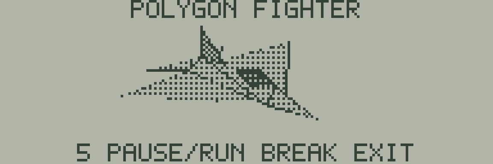

# 14 POLYGON FIGHTER — 陰影付きポリゴンの回転

シンプルな戦闘機を、20頂点・23枚の三角形で描くテックデモです。
起動すると自動的に一周64段階で回転します。機体の先端、左右の主翼、尾翼、暗いキャノピーを面で表現しています。



テンキーの **5** で一時停止／再開、**BREAK** でBASICへ戻ります。
文字キー側の5は使用しません。BREAK復帰は共通ライブラリのJR-HuBASIC 1.0向け処理です。
BASICのプログラムと変数は初期化されるため、起動前に作業内容を保存してください。2.0のBREAK復帰は未対応です。

## ビルドと実行

リポジトリのルートで実行します。SDKとWASMの準備は[共通の手順](../README.md#ビルドする)を参照してください。

```sh
make -C sdk/examples/lcd/14-polygon-fighter
make -C sdk/examples/lcd/14-polygon-fighter run
make -C sdk/examples/lcd/14-polygon-fighter test
```

実行ファイルは `build/sdk-lcd/14-polygon-fighter/14-polygon-fighter.j8a` です。
通常のWebエミュレーターでBASICを起動して一時停止し、「プログラム .WAV / .J8A」でこのファイルを選び、「読み込んで実行する」を押します。
`make run`は最初の画面を`screen.svg`へ保存します。`make debug`、`make clean`も利用できます。
一括ビルドの`make -C sdk/examples/lcd`にも含まれます。

## 描画の仕組み

回転済みの画像は持たず、JR-800のCPUが毎フレーム計算します。

1. **座標変換**: 64要素の正弦表で縦軸の回転を計算し、約22.5度傾けて表示します。小数を128倍した整数で表すQ7形式と、HD6301の乗算命令を使います。
2. **投影**: 奥行きによって大きさを変えない平行投影で、3次元の頂点をLCD上の座標へ変換します。
3. **面の向きと陰影**: 面の向きを示すベクトル（法線）も回転させ、裏向きの胴体の面を除きます。薄い翼と垂直尾翼は両面を描きます。画面の左上手前に置いた光と法線の向きから、面ごとの明るさを決めます。
4. **重なり**: 各三角形の頂点の奥行きの合計を比較し、安定な挿入ソートで奥の面から手前の面へ並べます。同じ奥行きではモデルの順序を維持します。
5. **塗りつぶし**: 三角形の辺と画面の横一列との交点を求め、その間を塗ります。縦8ドットを1バイトにまとめる既存のフレームバッファーへ、対象ビットだけを書き込みます。
6. **モノクロの陰影**: 2×2ドット内の黒の密度を25%、50%、75%、100%に変えるディザリングで濃淡を表します。輪郭は黒く描き、キャノピーは暗い色にします。白いドットも上書きするため、手前の面が奥の面を隠します。

描画用RAMは1画面分の1,536バイトです。三角形の間とLCDの転送区間ごとにキーを確認し、短い5の押下も保持します。
ホスト側に専用の描画・操作処理はありません。

## 高速化

最初の版と全64方向の画素・陰影・面の順序を保ち、平均12.40fpsで回転します。
前回の11.37fps版からfpsは約9.0%向上し、平均処理時間は約8.3%短縮しました。
各試作の比較は[追加最適化の検証記録](EXPERIMENTS.md)にまとめています。

| 一周64フレームでの測定 | 最初の版 | 前回の最適化 | 追加最適化後 |
| --- | ---: | ---: | ---: |
| 平均Eサイクル / フレーム | 250,842 | 108,027 | 99,086 |
| 公称クロックから換算した平均fps | 4.90 | 11.37 | 12.40 |
| 一周の時間 | 13.07秒 | 5.63秒 | 5.16秒 |
| 平均LCDデータ転送 / フレーム | 1,536バイト | 427.81バイト | 238.20バイト |
| コードと固定データ | 2,132バイト | 3,779バイト | 4,930バイト |
| 作業領域 | 320バイト | 347バイト | 932バイト |

- 毎フレームの固定待ちを外し、待ちループは一時停止中だけに限定しています。
- 縦8ドットの帯ごとに機体の左右端を記録し、その範囲を消去・転送します。新旧の範囲を合わせるため、前のフレームの画素も消えます。描画後の範囲検索は2バイトずつ進め、見出しと操作説明は初回だけ転送します。
- LCD転送は制御ポートごとのループで4バイトずつ処理し、ポインターの読み直しと分岐を減らします。**各コマンド・各データ書き込み前のBUSY待ちは維持**しています。
- 符号付きQ7乗算の符号処理を短縮し、同じ法線・材質が連続する面は、そのフレームで計算した陰影と表示判定を再利用します。生成データのフラグbit 2がこの再利用を示します。
- 三角形の頂点をY順に並べ、上下端を結ぶ辺と短い辺から各行の左右端を得ます。42本の共有辺は、実行時に計算した交点を689バイトの領域に保存して再利用します。交点の計算は傾きの商・余りから始め、各行は加算と最大1回の補正で進めます。水平な三角形は専用処理です。
- 行を移る際のLCDアドレスとビットマスクを逐次更新し、黒／白の処理を分けて8列ずつ塗ります。1〜2ドット幅の行は輪郭だけを描き、3〜7ドット幅も輪郭を含めた専用処理に分けています。

固定の俯角にしか依存しないYの乗算2回分は、モデル生成時に定数化します。キャノピーは表示判定後に既定の陰影を設定します。
回転する頂点と法線の変換、陰影判定、奥行き順の並べ替えは毎フレームCPUで実行します。辺のキャッシュは角度を識別し、同じ角度の計算結果だけを再利用します。
生成時に交点や回転画像を埋め込むことはありません。描画用RAMは引き続き1画面分で、コードと固定データは1,151バイト、作業領域は585バイト増えています。

## ソースとメモリー

| ファイル | 役割 |
| --- | --- |
| `main.s` | 起動、回転の更新、一時停止、LCD転送 |
| `renderer.s` | 整数による3D処理、奥行き順の並べ替え、三角形描画 |
| `spans.s` | 黒／白の組み合わせ別の塗りつぶしと短い行の専用処理 |
| `transfer.s` | このサンプル用の部分転送とBUSY待ち |
| `generate_model.py` / `model.s` | 独自の形状・正弦表・固定俯角の定数、辺の接続とキャッシュ配置 |
| `memory.j8l` | コード、描画用RAM、作業領域の配置 |
| `check.mjs` | WASM上の実行と独立した参照計算による検査 |

`model.s`は生成済みデータとして同梱します。モデルの定義を変えたら`python3 generate_model.py`で更新します。
`make test`は生成元との一致も検査します。生成時に作るのは固定の形状・法線・材質フラグ・正弦表・固定俯角の定数・辺の接続表と作業領域の配置です。辺ごとの最大行数を全64方向から求めますが、交点そのものは生成しません。

最終ビルドの配置量は、コードと固定データ4,930バイト、描画用RAM1,536バイト、状態932バイト、BASIC復帰処理76バイト、退避領域132バイトの**合計7,606バイト**です。
別途CPU内RAMの`$80–$D2`（表示・転送18＋描画65＝83バイト）とスタックを使います。SPは`$5FFF`で、上端512バイトをスタック用に空けています。
コードは`$2800`から、描画用RAMは`$4000`、状態は`$4600`、BASIC復帰は`$5400`、退避領域は`$5800`に配置します。`$2000–$27FF`には書き込みません。

このレンダラーは付属モデル用です。画面外の三角形の切り取りや、面同士が交差する形状の厳密な隠面処理は実装していません。
頂点・面の作業領域も20頂点・23面分です。形状、拡大率、俯角を変える場合は、固定俯角の定数・辺のキャッシュ配置も再生成し、作業領域と全64方向での表示範囲を確認してください。検査には最初の版の全64フレームのSHA-256も固定しているため、意図的に形状を変えた場合は、新しい表示を確認したうえでその参照値も更新します。

## 検証範囲

- **ビルド・静的確認**: Native Debug／Releaseの付属SDKでアセンブル・リンクし、同一バイナリーになること、モデルの再生成一致、配置量を確認。WASM Debug／Releaseの両方でも同一結果。
- **WASM実行**: 全64方向の座標、面の前後判定、陰影、奥行き順、全ピクセルの塗りつぶしを参照計算と比較。最初の版の全64フレームともSHA-256で照合。各辺の交点、キャッシュの容量と境界保護用バイト、固定俯角の定数も検査。LCD転送、スタック、コードと周辺RAMの保護、一周後の完全一致、押下／押し続け／解放／再開も検査。
- **短いキー入力**: 連続描画中の21通りの開始時刻で49,152 Eサイクルの5入力を与え、一時停止と再開を確認。全64方向での最大キー確認間隔は14,431 Eサイクル（公称約11.7ms）で、最小保持時間より短いことも検査。
- **Native検査**: サンプル専用の`transfer.s`を既存の遅延BUSY検査に渡し、待ち0・1・8回と起動時BUSYの有無を組み合わせた6条件で成功。部分転送の境界と転送不要時も検査。共通の転送分割・BASIC復帰検査も成功。
- **通常のブラウザー**: 所有するJR-HuBASIC 1.0を起動し、生成したJ8Aの読み込み、回転、5での停止／再開、BREAK後の空のBASIC画面と入力待ちを確認。停止中の画面は時間を空けたスクリーンショットでも一致し、ブラウザーの警告・エラーログはありませんでした。

一周分の描画は1フレーム90,137〜106,472 Eサイクル、平均99,086.453125 Eサイクルでした。
公称1.2288 MHzで換算すると約11.54〜13.63 fps、平均12.40fps、一周約5.16秒です。ブラウザーの実時間や実機のLCD応答を保証する値ではありません。

既定の検査は独自の起動用データを使い、拡張RAMを無効にしています。
`JR800_SAMPLE_ROM=/absolute/path/to/your-rom.j8r make test`で所有ROMでも検査できます。この場合はROMの起動処理に合わせ、通常のブラウザーと同じ拡張RAM設定を使用します。
独自の起動用データと所有ROMの両方で、180回の停止位置での検査が成功し、最初の画面と一周分の処理時間も一致しました。
検査は平均100,000・最大110,000 Eサイクル未満、通常フレームのLCD転送300バイト以下も要求します。
結果は生成先の`verification.json`／`verification-owned-rom.json`へ保存します。`rotation-00.svg`など8方向の画像と、一周分のLCDデータ`rotation.json`も出力します。

LCDの遅延BUSY検査を再実行する場合は、リポジトリのルートで次を実行します。

```sh
cmake --build --preset native-release --target lcd_sample_busy_test
make -C sdk/examples/lcd/14-polygon-fighter test-busy
```

実機での転送・実行、LCDの物理的な残像や電気的タイミングは未検証です。
LCDとBASIC復帰には既存ライブラリの動作範囲を引き継ぎ、新しいハードウェア動作は仮定していません。

ソース、形状データ、検査コードは本プロジェクトで新規作成したMITライセンスの成果物です。
