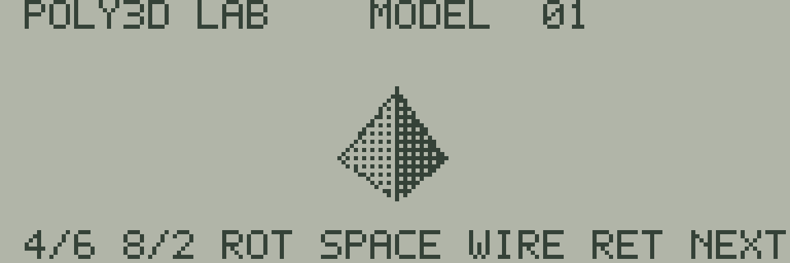

# 15 POLY3D LAB

三角錐・八面体・立方体を、共通の[poly3dライブラリ](../../../lib/poly3d/README.md)で回転・陰影表示する実証コードです。



| キー | 操作 |
| --- | --- |
| テンキー4／6、A／D | 左右へ回転。自動回転は止まる |
| テンキー8／2、W／S | 上下へ回転。自動回転は止まる |
| SPACE | 陰影付きの面／前面の線表示を切替 |
| RETURN | 三角錐→八面体→立方体へ切替、自動回転を再開 |
| BREAK | BASICへ戻る |

MODEL 01は4頂点・4三角形、02は6頂点・8三角形、03は8頂点・12三角形です。1回の操作で角度が4/64周変わります。長押しで方向入力を反復できます。矢印キーや文字キー側の数字は操作に使いません。

```sh
make -C sdk/examples/lcd/15-poly3d-lab
make -C sdk/examples/lcd/15-poly3d-lab test
```

実行ファイルは`build/sdk-lcd/15-poly3d-lab/15-poly3d-lab.j8a`です。[通常のWeb画面での読み込み手順](../README.md#webエミュレーターで動かす)を使います。`make run`は初期画面のSVGを出力、`make debug`はフレーム完成位置のCPU状態を表示、`make clean`はビルド結果を削除します。

2026-09-15のWASM Release検査では、モデルごとに64方向を回転させ、公称CPUクロック換算の平均は三角錐14.64fps、八面体9.75fps、立方体6.24fpsでした。これはLCD転送と入力走査を含む値で、実機のLCD残像やBUSY時間の測定ではありません。

`check.mjs`は235フレームでモデル切替・全方向・陰影／線表示・2軸操作を確認します。共通検査は全LCD画素、描画面、周辺RAM、スタック、入力走査の最大間隔を確認し、`verification.json`へ記録します。共有のプログラムループは`../common/poly3d-runtime.s`、メッシュは`../../../lib/poly3d/models.s`です。

BREAK復帰はJR-HuBASIC 1.0用で、空のBASICプログラム領域へ戻ります。実行前のプログラムと変数は保存しておいてください。実機・カセット転送は未検証です。
