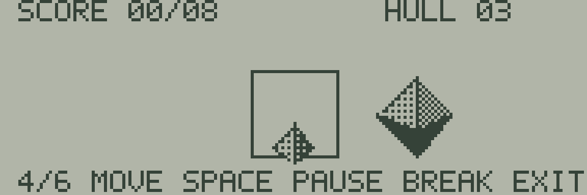

# 16 GATE FLIGHT

三角錐の自機を左右へ動かし、接近するゲートを8個通過する試作です。八面体の障害物とゲートを大きくして奥行きを表します。



| キー | 操作 |
| --- | --- |
| SPACE／RETURN | タイトル・終了画面から開始／再挑戦 |
| テンキー4／6、A／D | 左右移動。押している間移動 |
| SPACE | プレイ中は一時停止／再開 |
| BREAK | BASICへ戻る |

ゲートが自機へ届くまでに、中央に自機を合わせます。通過位置は左・中央・右の3種類です。1ゲートは36回の更新で到達し、中心から横方向10ドット未満なら通過として1点、それ以外ならHULLが1減ります。HULLは3から始まり、0で失敗、8点でクリアです。障害物は危険なレーンの目印で、ポリゴン表面同士の3D衝突判定ではありません。

```sh
make -C sdk/examples/lcd/16-gate-flight
make -C sdk/examples/lcd/16-gate-flight test
```

実行ファイルは`build/sdk-lcd/16-gate-flight/16-gate-flight.j8a`です。[通常の読み込み手順](../README.md#webエミュレーターで動かす)を使います。`make run`、`make debug`、`make clean`も利用できます。文字キー側の数字や矢印キーは移動に使いません。同時押しは必要ありません。

[poly3d](../../../lib/poly3d/README.md)が立体2個とゲートの4辺を描き、`main.s`が移動・通過・得点・耐久力・再挑戦を処理します。視点は固定、立体の投影は平行投影で、接近感は原点と倍率の変化によるものです。

2026-09-15のWASM Release自動プレイでは、ゲーム中284フレームの平均133,397 Eサイクル、約9.21fpsでした。入力走査間隔の最大は30,024 Eサイクルです。公称クロック換算であり、実機での測定値ではありません。

445フレームの検査で、一時停止中の不変性、全ゲート通過、左右の移動制限、失敗と再挑戦を確認します。キー入力以外でゲーム状態を書き換えません。LCDと描画RAMの全画素一致、スタック、周辺RAMも確認し、結果を`verification.json`へ出力します。

BREAK復帰はJR-HuBASIC 1.0用です。空のBASICプログラム領域へ戻るため、事前のプログラムと変数は保存してください。実機の操作感・LCD残像・カセット転送は未検証です。
