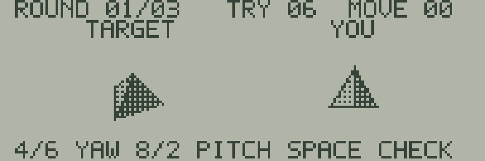

# 18 TURN MATCH

右の三角錐を回転し、左の見本と向きを合わせるパズルの試作です。見本と操作対象は同じ形・倍率・照明で描きます。



| キー | 操作 |
| --- | --- |
| SPACE／RETURN | タイトル・終了画面から開始／再挑戦 |
| テンキー4／6、A／D | 左右方向の回転（yaw） |
| テンキー8／2、W／S | 上下方向の回転（pitch） |
| SPACE | 現在の向きで回答 |
| BREAK | BASICへ戻る |

1回の方向入力で45度、8回で1周します。長押しすると方向入力を反復します。まず形の輪郭を合わせ、面の明暗も比較してください。2つの回転角が見本と一致すれば次の問題へ進みます。3問すべて正解でクリアです。

間違った回答ではTRYが1減り、6回の間違いで失敗します。SPACEの押しっぱなしで回答は繰り返しません。MOVEは回転操作の回数を99まで数えます。制限時間はありません。向きは角度で判定し、似た画素になっただけの別角度は正解にしません。

```sh
make -C sdk/examples/lcd/18-turn-match
make -C sdk/examples/lcd/18-turn-match test
```

実行ファイルは`build/sdk-lcd/18-turn-match/18-turn-match.j8a`です。[通常の読み込み手順](../README.md#webエミュレーターで動かす)を使います。`make run`、`make debug`、`make clean`も利用できます。文字キー側の数字や矢印キーは回転に使いません。

[poly3d](../../../lib/poly3d/README.md)のパラメーターを物体ごとに変え、1フレーム内で2回描画します。見本・操作対象・問題の進行・残り回答回数は`main.s`にあります。

2026-09-15のWASM Release検査では、操作中50フレームの平均129,611 Eサイクル、約9.48更新/秒でした。静止パズルなので、これは連続した動きのfpsではなく描画を含む更新速度です。入力走査間隔の最大は30,247 Eサイクルでした。

79フレームの検査で、3問正解、間違い、長押しの非連続回答、角度の周回、失敗と再挑戦を確認します。正解時は、2個の立体の画素も平行移動後に完全一致することを確認します。LCD・描画RAM・スタック・周辺RAMの結果を`verification.json`へ記録します。

BREAK復帰はJR-HuBASIC 1.0用です。空のBASICプログラム領域へ戻るため、実行前のプログラムと変数は保存してください。実機での操作感・LCD残像・カセット転送は未検証です。
